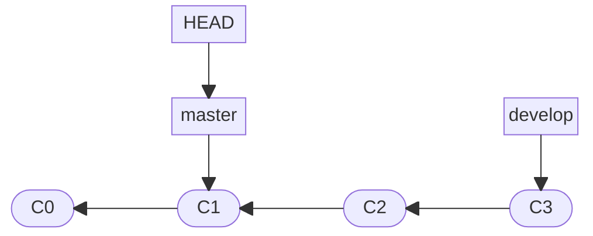
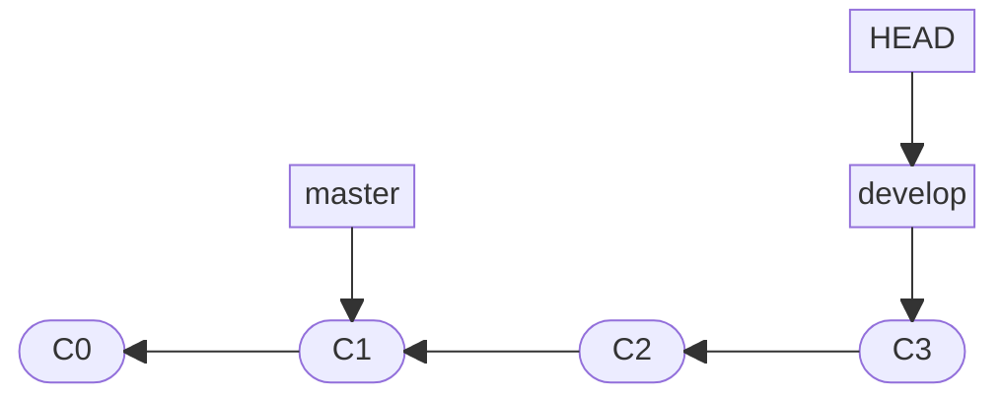
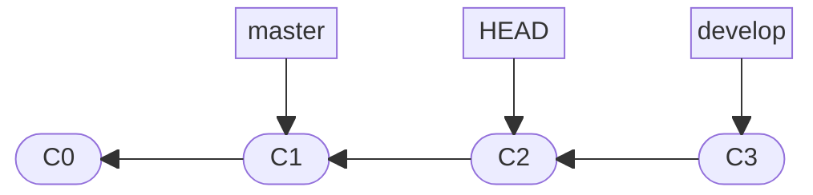

# Git 分支详解

## 提交与哈希值机制

Git 中的每个提交都是一个完整的文件系统快照，包含了文件的完整快照、提交时间、作者信息、提交说明以及指向父提交的指针。Git 基于这些内容计算生成唯一的 SHA-1 哈希值来标识每个提交。

这种基于哈希值的快照机制确保了 Git 版本历史的完整性和不可篡改性。任何对提交内容的修改都会导致哈希值的改变，从而能够有效检测数据损坏或篡改。

在实际使用中，通常不需要使用完整的 40 位哈希值，Git 支持使用前 7 位或更多位来唯一标识一个提交。

## 分支的本质

分支与标签本质上相同，都属于 "引用（Ref）"，是指向特定提交哈希值的指针。

二者的核心区别在于：

- 标签是静态的，自创建后便固定指向某一特定提交；

- 分支是动态的，每当该分支上产生新提交时，其指针会自动前移以指向最新的快照。

## HEAD 指针

HEAD 是 Git 中一个特殊的指针，它指向当前所在的本地分支。可以将 HEAD 理解为 "当前正在工作的位置"。当 HEAD 指向某个分支时，该分支就被称为 "当前分支" 或 "活跃分支"。

通常情况下，HEAD 指向某个分支（如 `master`、`develop`），当 HEAD 指向分支时，实际上是通过分支间接指向具体的提交。



> [!note]
> 
> 由于 HEAD 指针、分支名、标签名最终都会被 Git 解析为提交哈希值，因此，在绝大多数命令中，这四者（即 HEAD 指针、分支名、标签名和提交哈希值）作为参数通常是可以互换的。

## 分支切换的本质

分支切换的本质就是移动 HEAD 指针，使其指向不同的分支。`git checkout`（或 `git switch`）命令的核心作用就是改变 HEAD 指针的指向。



当切换分支时，Git 实际上执行了以下两步操作：

1. **更新 HEAD**：将 HEAD 指针指向目标分支。

2. **更新工作区**：用目标分支指向的快照内容替换当前工作目录中的文件。

这种设计的优势在于分支切换极其快速，因为 Git 只需要改变指针的指向，而不需要复制整个项目文件。

## 分离头指针状态

由于分支本质上是一个会随着新提交自动更新的哈希值别名，因此 `git checkout` 命令后也可以直接接某个具体的哈希值。

此时，HEAD 指针会直接指向该具体的提交，而不是指向某个分支别名。这种状态被称为 "分离头指针（Detached HEAD）" 状态。

```bash
# 直接检出具体的提交记录，进入分离头指针状态
git checkout <commit-hash>
```



## 查看 HEAD 指针

可用如下命令查看当前 HEAD 指针指向的具体内容或分支：

```bash
# 查看本地 .git 目录下的 HEAD 文件内容
cat .git/HEAD

# 获取 HEAD 指向的符号引用（标准 Git 命令方式）
git symbolic-ref HEAD
```

## 相对引用

通过指定提交记录哈希值的方式在 Git 中移动，需要用户每次都去查找并输入完整的或部分哈希值。为了提升效率，Git 提供了相对引用机制，允许基于参考点（如 HEAD、分支名、标签名、提交哈希值）在提交历史中进行相对导航。

相对引用主要使用两种操作符：`~` 和 `^`。

- `~` 符号：用于在垂直方向向上移动世代（回溯历史）。

  - `HEAD~` 或 `HEAD~1`：向上移动一代，指向父提交。

  - `HEAD~2` 或 `HEAD~~`：向上移动两代，指向祖父提交。

- `^` 符号：一般用于在水平方向寻找多重父提交（处理合并节点）。

  - `HEAD^` 或 `HEAD^1`：指向当前提交的第一个父提交（常规提交的唯一父节点）。

  - `HEAD^^`：沿着第一父线连续回溯两代，指向祖父提交（等同于 `HEAD~2`）。

  - `HEAD^2`：指向合并提交的第二个父提交（即执行合并时，被合并进来的分支提交）。

  > [!note]
  > 
  > `HEAD^^` 和 `HEAD^2` 是不一样的。

`^` 和 `~` 可以组合使用来处理复杂的分支结构：

```bash
# 先向上移动三代，然后选择第二个父提交
git checkout HEAD~3^2
```
