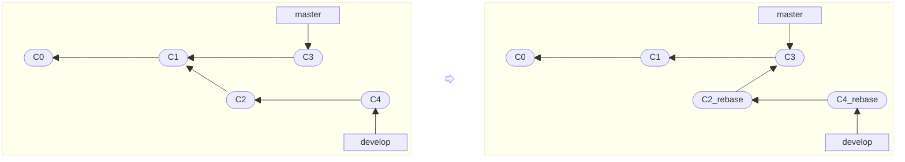

# Git 变基挑拣

## 分支变基

变基是另一种整合分支更改的方法，它会将当前分支的提交 "重新播放" 到目标分支的最新提交之上，从而创建更加线性的项目历史。

可以使用以下命令将当前分支变基到目标分支：

```bash
git rebase <target-branch>
```

变基的原理是找到当前分支与目标分支的最近共同祖先，然后提取当前分支相对于该祖先的所有提交修改，将其保存为临时文件。接着将当前分支指向目标分支的最新提交，最后将之前保存的修改按顺序作为全新的提交重新应用一遍。

新生成的提交虽然内容和原来的完全一样，但会拥有全新的哈希值。即下图中的 `C2` 与 `C2_rebase` 以及 `C4` 与 `C4_rebase` 虽然内容相同，但并非同一个提交。



> [!CAUTION]
> 
> 由于变基会重写提交历史，因此不推荐在已推送到公共仓库的分支上执行变基操作，以免给其他协作者带来困扰。

### 交互式变基

交互式变基提供了更精细的控制，使用 `-i` 或 `--interactive` 选项启动交互式变基：

```bash
# 指定目标分支进行交互式变基
git rebase -i <target-branch>

# 指定具体的提交哈希进行交互式变基（如回溯最近 3 个提交）
git rebase -i HEAD~3
```

交互式变基会打开编辑器显示待变基的提交列表，每个提交前都有一个操作命令（默认为 `pick`），用于指定对该提交执行的操作。编辑器同时以注释形式提供了完整的操作选项说明，常用选项及其作用如下：

- `p, pick`：保留该提交（不做更改）；

- `r, reword`：保留该提交，但修改提交说明；

- `e, edit`：保留该提交，但暂停以进行修改（例如，添加文件或修改内容）；

- `s, squash`：保留该提交，但将其合并到前一个提交中（提交说明会被合并）；

- `f, fixup`：类似于 `squash`，但丢弃当前提交的提交说明；

- `d, drop`：删除该提交。

常见用途：

- 合并多个提交：将多个小提交合并为一个更有意义的提交；

- 拆分单个提交：将一个包含多项不相关改动的巨大提交拆分为多个职责单一的精确提交；

- 修改提交说明：重新编写不清晰或不准确的提交说明；

- 重新排序提交：调整提交的顺序以创建更合理的逻辑流程；

- 删除或编辑特定提交：移除不必要的提交或修复有问题的提交。

## 提交挑拣

`git cherry-pick` 命令用于提取指定的提交所引入的差异补丁，并将其作为全新的提交应用到当前分支上。  

常用于从其他分支中挑拣特定的提交合并，而不是合并整个分支的所有变更。

- **执行挑拣**：  

  ```bash
  # 挑拣单个或多个零散的提交（Git 会按从左到右的顺序依次应用补丁）
  git cherry-pick <commit1-hash> [<commit2-hash> ...]
  ```

  当同时挑拣多个提交时，Git 会为每一个被挑拣的提交分别生成对应的全新提交，而不会将它们自动打包成一个大提交。

- **常用附加选项**：  

  ```bash
  # 使用 -e 选项在应用补丁后暂停并打开编辑器，用于在生成提交前修改提交说明
  git cherry-pick -e <commit-hash>

  # 使用 -x 选项在提交说明末尾自动追加原始哈希值注释，用于标明代码出处
  git cherry-pick -x <commit-hash>

  # 使用 -n 选项将差异应用到工作区和暂存区，但不立即生成提交（常用于二次修改）
  git cherry-pick -n <commit-hash>
  ```

- **处理冲突**：

  在挑拣过程中，若补丁应用失败则会暂停并引发合并冲突。在手动解决冲突并使用 `git add` 标记解决后，执行以下命令继续流程：  

  ```bash
  git cherry-pick --continue
  ```

  或者执行以下命令放弃本次操作，将工作区恢复至挑拣前的状态：  

  ```bash
  git cherry-pick --abort
  ```
