# 系统的方框图表示

## 微分方程描述系统的方框图表示

一个线性常系数微分方程涉及三种基本运算：乘系数、相加和微分。

但是微分器抗干扰能力差，因此在系统实现时一般采用积分器作为基本单元。

- 乘系数：
  
  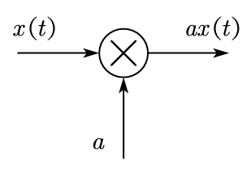

  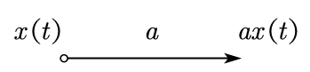

- 相加：
  
  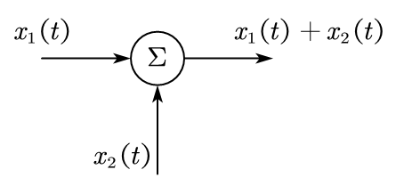

- 积分：

  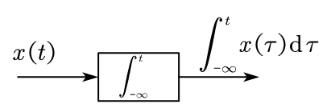

### 一阶系统的方框图描述

一阶微分方程一般形式为

$$
a_1 y'(t) + a_0 y(t) = b_1 x'(t) + b_0 x(t)
$$

直接 $\text{II}$ 型结构的系统框图为

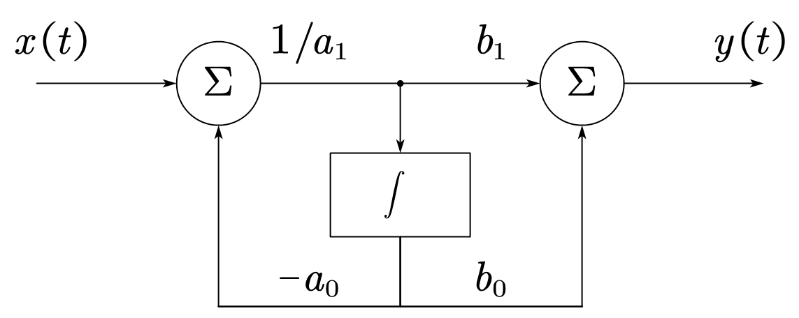

---

**推导过程**

一阶微分方程一般形式为

$$
a_1 y'(t) + a_0 y(t) = b_1 x'(t) + b_0 x(t)
$$

两边积分得

$$
a_1 y(t) + a_0 \int_{-\infty}^{t} y(\tau) \, \mathrm{d} \tau = b_1 x(t) + b_0 \int_{-\infty}^{t} x(\tau) \, \mathrm{d} \tau
$$

若令

$$
w(t) = b_1 x(t) + b_0 \int_{-\infty}^{t} x(\tau) \, \mathrm{d} \tau
$$

则有

$$
a_1 y(t) + a_0 \int_{-\infty}^{t} y(\tau) \, \mathrm{d} \tau = w(t)
$$

画出上面两式的系统框图：

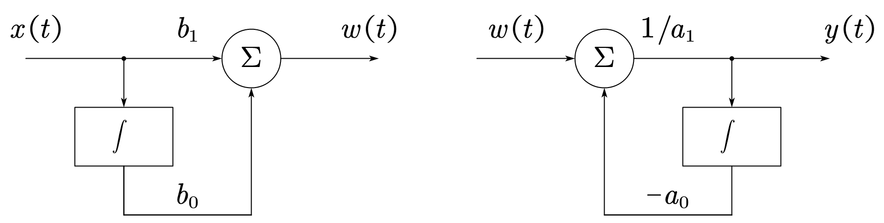

将两个框图级联起来，得到微分方程的直接 $\text{I}$ 型结构：

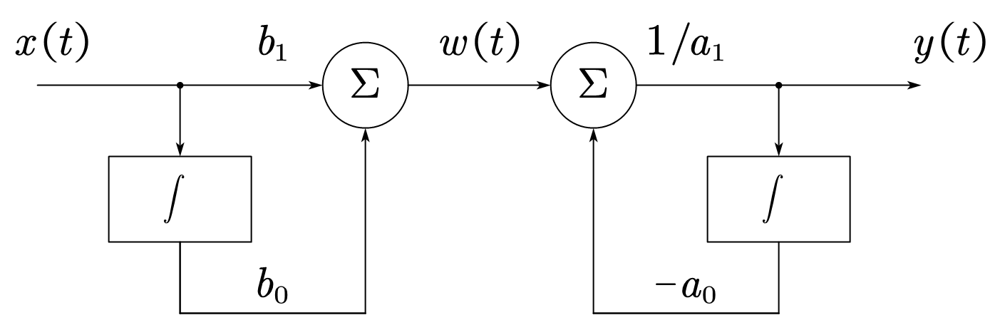

在 LTI 系统中级联子系统可以互换位置，交换位置后，两个积分器具有相同的输入，可以合并为一个积分器，从而得到微分方程的直接 $\text{II}$ 结构：

### $N$ 阶系统的方框图描述

$$
\sum_{k = 0}^{N} a_k \frac{\mathrm{d}^{k} y(t)}{\mathrm{d} t^{k}} = \sum_{k = 0}^{M} b_k \frac{\mathrm{d}^{k} x(t)}{\mathrm{d} t^{k}}
$$

通常情况下 $N \geqslant M$。

直接 $\text{II}$ 结构的系统框图为：

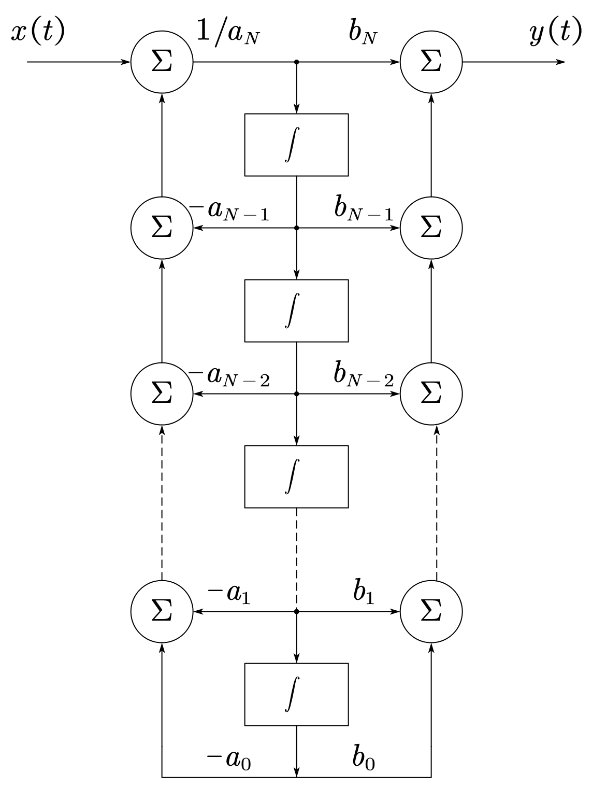

## 差分方程描述系统的方框图表示

一个线性常系数差分方程涉及三种基本运算：乘系数、相加和序列延时（移位）。

- 乘系数：
  
  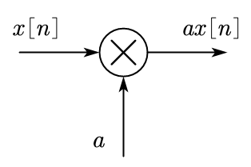

  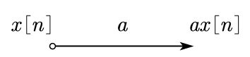

- 相加：
  
  

- 序列延时：

  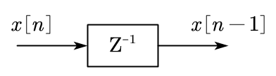

### 一阶系统的方框图描述

一阶差分方程一般形式为

$$
a_0 y[n] + a_1 y[n - 1] = b_0 x[n] + b_1 x[n - 1]
$$

直接 $\text{II}$ 型结构的系统框图为：

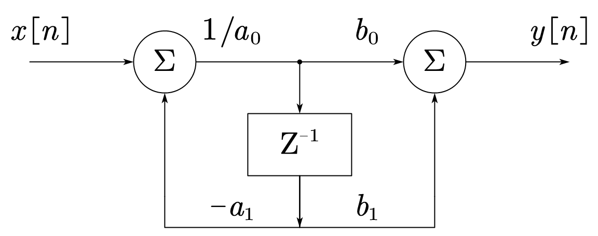

### $N$ 阶系统的方框图描述

$$
\sum_{k = 0}^{N} a_k y[n - k] = \sum_{k = 0}^{M} b_k x[n - k]
$$

直接 $\text{II}$ 结构的系统框图为：

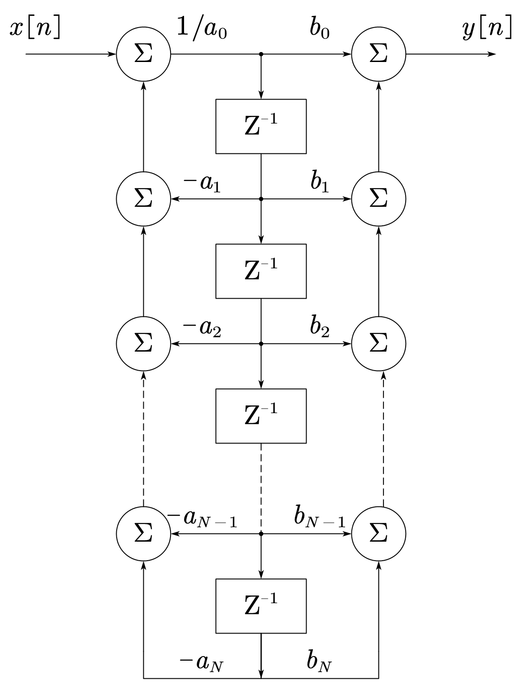

### FIR 系统

用下列差分方程形式描述的系统有着较为广泛的应用，因为它总是稳定的。

$$
y[n] = \sum_{k = 0}^{M} b_k x[n - k]
$$

令 $x[n] = \delta[n]$，可得

$$
h[n] = b_0 \delta[n] + b_1 \delta[n - 1] + \cdots + b_M \delta[n - M]
$$

其中 $h[n]$ 为有限长，因此这类系统称为有限长脉冲响应系统（Finite Impulse Response，FIR）。

该系统的结构：

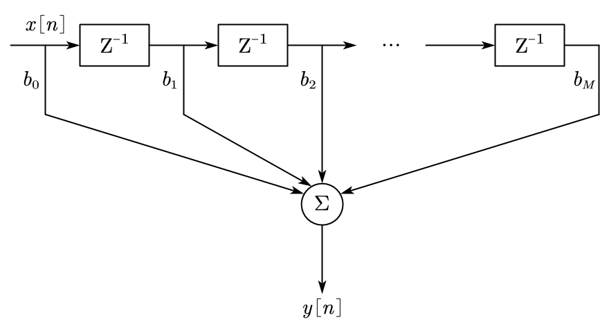
