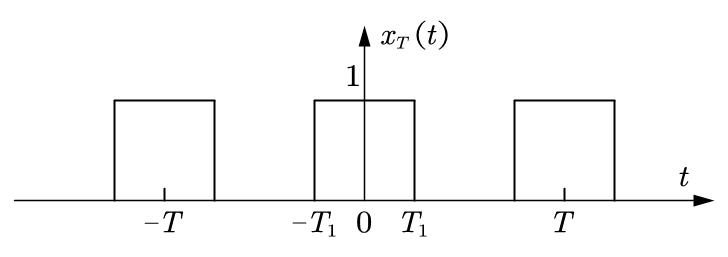
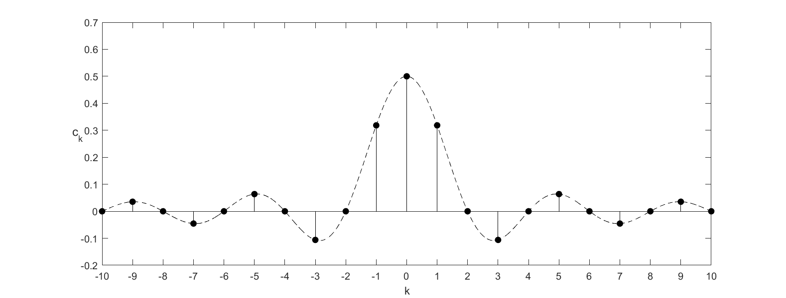

# 周期信号的傅里叶级数分析

## 周期信号的傅里叶级数展开

### 指数函数展开式

一个周期为 $T$ 的周期信号 $x_T(t)$ 可以表示成指数函数傅里叶级数

$$
x_T(t) = \sum_{k = -\infty}^{\infty} c_k e^{\mathrm{j} k \omega_0 t} = \sum_{k = -\infty}^{\infty} c_k e^{\mathrm{j} k \frac{2\pi}{T} t}
$$

$$
c_k = \frac{1}{T} \int_T x_T(t) e^{-\mathrm{j} k \omega_0 t} \, \mathrm{d} t = \frac{1}{T} \int_T x_T(t) e^{-\mathrm{j} k \frac{2\pi}{T} t} \, \mathrm{d} t
$$

通常情况下 $c_k$ 为复数，可写成模和幅角的形式

$$
c_k = |c_k| e^{\mathrm{j} \theta_k}
$$

### 方波信号的傅里叶级数展开

$$
\begin{split}
    c_k &= \frac{1}{T} \int_{-T_1}^{T_1} e^{-\mathrm{j} k \omega_0 t} \, \mathrm{d} t = \frac{2T_1}{T} \frac{\sin k \omega_0 T_1}{k \omega_0 T_1} \\
    &= \frac{2T_1}{T} \operatorname{Sa}(k \omega_0 T_1) = \frac{2T_1}{T} \operatorname{sinc}\left(k \frac{2T_1}{T}\right)
\end{split}
$$

令 $T_1 = 1$，$T = 4$，得到如下频谱：

- **频谱间隔——信号分量的频率间距**

  当给定周期 $T$ 后，频谱间隔 $\omega_0 = \dfrac{2\pi}{T}$ 就固定了。$T$ 值越大，谱线间隔越小，谱线越密。

- **谱线的包络线及其零点位置**

  将 $c_k$ 中的 $k \omega_0$ 用连续变量 $\omega$ 替换，则得到连续函数 $\dfrac{2T_1}{T} \operatorname{Sa}(\omega T_1)$，对应的连续曲线称为谱线的包络线。当 $\omega T_1 = m\pi$ 时（$m = \pm1, \pm2, \dots$），$\operatorname{Sa}(\omega T_1) = 0$，因此谱线包络的零点位置为

  $$
  \omega = m \frac{\pi}{T_1}
  $$

  所以，当给定方波信号的宽度 $2T_1$ 后，包络的零点位置也就随之固定。当方波脉宽增大时，包络线的零点位置将向坐标原点收缩。

**总结**：方波信号的周期决定了谱线间隔，脉宽决定了包络线的零点位置。

### 三角函数展开式

$$
x_T(t) = A_0 + \sum_{k = 1}^{\infty} A_k \cos(k \omega_0 t + \theta_k)
$$

$$
A_0 = c_0, \quad A_k = 2|c_k| \, (k \geqslant 1)
$$

上式表明一个周期信号可以分解为直流信号分量和一系列正弦信号分量的叠加，其中 $k = 1$ 时正弦分量称为基波分量，$k \geqslant 2$ 时称为谐波分量，$k = m$ 时称为 $m$ 次谐波分量。

另一种常见形式

$$
x_T(t) = c_0 + \sum_{k = 1}^{\infty} [a_k \cos k \omega_0 t + b_k \sin k \omega_0 t]
$$

$$
a_k = 2|c_k| \cos \theta_k, \quad b_k = -2|c_k| \sin \theta_k, \quad \theta_k = \arctan \left(\frac{-b_k}{a_k}\right)
$$

### 常用周期信号的傅里叶级数展开

- 三角波：$c_k = \dfrac{A}{2} \operatorname{Sa}^2\left(\dfrac{k\pi}{2}\right) = \dfrac{A}{2} \operatorname{sinc}^2\left(\dfrac{k}{2}\right)$

- 锯齿波：$c_0 = \dfrac{A}{2}$，$c_k = \mathrm{j}(-1)^k \dfrac{A}{2k\pi} \, (k \ne 0)$

## 复指数展开式系数的基本性质

- **性质 1**

  若周期信号 $x_T(t)$ 为实函数，则 $c_k$ 具有共轭对称性，即

  $$
  c_{-k} = c_k^*
  $$

- **性质 2**

  若周期信号 $x_T(t)$ 为实函数，则 $c_k$ 的模是 $k$ 的偶函数，$c_k$ 的相位是 $k$ 的奇函数，即

  $$
  |c_{-k}| = |c_k|
  $$

  $$
  \theta_{-k} = -\theta_k
  $$

- **性质 3**

  若周期信号 $x_T(t)$ 是实偶函数，则 $c_k$ 是 $k$ 的实偶函数，即

  $$
  c_k^* = c_k, \quad (\text{实函数})
  $$

  $$
  c_{-k} = c_k, \quad (\text{偶函数})
  $$

详细推导过程及更多性质见[共轭对称性分析](./共轭对称性分析)。

## 周期信号的频谱

### 幅频特性和相频特性——信号的频域描述

周期信号各分量的幅值 $A_k$ 和相角 $\theta_k$ 随频率 $k \omega_0$ 变化的规律是在频域中对周期信号的充分描述。这一频域中的描述称为周期信号的频谱或频谱特性。

从幅频特性图中可以知道信号的频率成分构成及各频率分量（包括直流）的幅度（$A_k$）大小。

从相频特性图中可以知道各频率分量的初相位（$\theta_k$）大小。

用 $A_k$ 和 $\theta_k$ 表示的频谱没有负频率，具有较为清晰的物理概念，通常称为单边谱或物理谱。$A_k$ 表示每个正弦频率分量的实际幅度大小。

用 $|c_k|$ 和 $\theta_k$ 表示的频谱称为双边谱，双边谱和单边谱之间的关系为 $A_0 = c_0$，$A_k = 2|c_k|$。

### 周期信号频谱的特点

- 任何周期信号的频谱都具有离散性和谐波性。

  从周期信号的傅里叶级数展开式可以看到：周期信号只含直流和频率为 $k \omega_0$ 的基波和谐波分量，频谱图是等间隔的离散谱线。离散性和谐波性是周期信号频谱的基本特征。

- 常见周期信号的频谱具有衰减性和无限大带宽。

  周期信号均含有频率趋于无穷大的谐波分量（即带宽无限大）。但随着频率的增高，谐波分量的幅度逐渐衰减为零。

  由于冲激函数时域波形变化速度达到极限，周期冲激信号的谐波分量幅度没有衰减，这是唯一的特例。

- 时域中信号的跳变会产生丰富的高频分量。

  频率是反映信号变化快慢的物理量。如果一个周期信号从时域中观察含有快速变化的部分，则可以从频域中看到其高频分量比较丰富或高频分量幅值衰减较慢；反之，该信号的低频分量较为丰富或幅值较强。
  
  信号取值的"跳变"是一种局部的最快变化，它将导致信号含有频率为无穷大的高频分量。一般来说，跳变越多或跳变的幅度越大，高频分量的幅度将越大。

### 信号的有效带宽

**有效带宽**：在该带宽内所有信号分量的合成能够体现原来信号的主要特征。

信号带宽的选取，多数情况下的选择是能包含 $90\%$ 以上信号能量的带宽。

对于方波信号，通常选取直流到频谱包络线的第一个零点（$f = 1 / 2T_1$）之间的频带宽度作为有效带宽，即

$$
B = \frac{1}{2T_1}
$$

方波的有效带宽 $= 1 /$ 方波脉宽。如此定义方波的有效带宽，既合理地考虑了频谱的结构特点，同时也满足 $90\%$ 能量的要求。