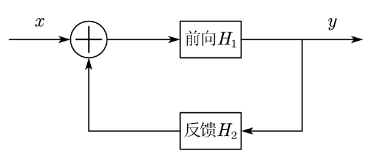

# 连续时间 LTI 系统的频域分析

## 连续时间 LTI 系统的频域表示

### 系统的频率响应特性

LTI 系统的零状态响应为：

$$
y(t) = x(t) * h(t)
$$

两边取傅里叶变换并应用时域卷积定理得：

$$
Y(\omega) = X(\omega) H(\omega)
$$

因此，$h(t)$ 的傅里叶变换 $H(\omega)$ 在频域中充分表征了一个 LTI 系统，称 $H(\omega)$ 为系统的频率响应特性或频率响应函数。一般 $H(\omega)$ 为复函数，写为模和辐角的形式：

$$
H(\omega) = \frac{Y(\omega)}{X(\omega)} = |H(\omega)| e^{\mathrm{j} \varphi(\omega)}
$$

其中，$|H(\omega)|$ 称为系统的幅频特性，$\varphi(\omega)$ 称为系统的相频特性。

$H(\omega)$ 描述了 LTI 系统对不同频率输入信号频率的 "响应"，或者说描述了系统的频域特性。

### $H(\omega)$ 的一般形式

由于 $N$ 阶线性常系数微分方程的一般形式为：

$$
\sum_{k = 0}^{N} a_k \frac{\mathrm{d}^{k} y(t)}{\mathrm{d} t^{k}} = \sum_{k = 0}^{M} b_k \frac{\mathrm{d}^{k} x(t)}{\mathrm{d} t^{k}}
$$

因此对于 $N$ 阶微分方程系统有：

$$
H(\omega) = \frac{Y(\omega)}{X(\omega)} = \frac{\sum\limits_{k = 0}^{M} b_k (\mathrm{j} \omega)^k}{\sum\limits_{k = 0}^{N} a_k (\mathrm{j} \omega)^k} = \frac{B(\mathrm{j} \omega)}{A(\mathrm{j} \omega)}
$$

### 互联系统的频率响应函数

- **串联系统**：$H(\omega) = H_1(\omega) H_2(\omega)$；

- **并联系统**：$H(\omega) = H_1(\omega) + H_2(\omega)$；

- **反馈系统**：

  

  在上图的输出端列方程，则有：

  $$
  Y(\omega) = [X(\omega) + H_2(\omega) Y(\omega)] H_1(\omega)
  $$

  可得反馈系统的总频率响应为：

  $$
  H(\omega) = \frac{H_1(\omega)}{1 - H_1(\omega) H_2(\omega)}
  $$

## 理想传输系统和滤波器

### 理想传输系统与线性相位条件

传输系统的目的是将信号尽可能不失真地从一端传输到另一端，可以允许有传输时延。因此，对于任意信号的理想传输系统，其输入输出关系应为：

$$
y(t) = x(t - t_0)
$$

两边取傅里叶变换后可得理想传输系统的频率响应特性为：

$$
H(\omega) = \frac{Y(\omega)}{X(\omega)} = e^{-\mathrm{j} \omega t_0}
$$

其幅频特性和相频特性分别为：

$$
|H(\omega)| = 1; \quad \varphi(\omega) = -\omega t_0
$$

上述结果给出两个重要概念：

- 如果要实现理想传输，系统必须具有线性相位特性。

- 对于可实现的连续时间系统，$\varphi(\omega)$ 应该具有负斜率特性。

### 理想滤波器的概念

根据允许通过的信号频率范围，可以将滤波器分为：低通、高通、带通和带阻滤波器。这一分类是根据其幅频特性进行的。

理想滤波器有两个含义：

- 幅频特性是理想化 "方波型" 函数。

- 相频特性是理想化的线性相位特性（理想传输要求线性相位特性）。

### 理想低通滤波器

由于理想低通滤波器要求在通带内，系统对所有的输入信号频率分量具有相同的单位增益，并且具有负斜率线性相位特性（理想传输特性），因此其频率响应 $H(\omega)$ 应为：

$$
H(\omega) = |H(\omega)| e^{\mathrm{j} \varphi(\omega)} = \begin{cases}
  e^{-\mathrm{j} \omega t_0}, & |\omega| < \omega_c \\
  0, & |\omega| > \omega_c
\end{cases}
$$

即：

$$
|H(\omega)| = \begin{cases}
  1, & |\omega| < \omega_c \\
  0, & |\omega| > \omega_c
\end{cases}; \quad \varphi(\omega) = \begin{cases}
  -\omega t_0, & |\omega| < \omega_c \\
  0, & |\omega| > \omega_c
\end{cases}
$$

上述 $H(\omega)$ 是频域方波，可得理想低通滤波器的冲激响应函数为：

$$
h(t) = \mathscr{F}^{-1}\{H(\omega)\} = \frac{\omega_c}{\pi} \operatorname{Sa}[\omega_c (t - t_0)] = \frac{1}{\pi (t - t_0)} \sin \omega_c (t - t_0)
$$

## 因果稳定系统的频率响应特性

实际应用中可实现的连续时间系统一定是因果的，并且通常还要求它也是稳定的。这里分析一下因果稳定系统的 $H(\omega)$ 应具有的特点。

- **稳定性**：稳定系统的冲激响应 $h(t)$ 满足绝对可积，其傅里叶变换积分一定收敛。因此，稳定系统的 $H(\omega)$ 一定是普通意义下的函数（即不会含有类似 $\delta(\omega \pm \omega_0)$ 的频域冲激函数）。

- **因果性**：假设 $h(t)$ 是一个因果系统的冲激响应，由因果性知 $h(t)$ 一定是单边信号（即当 $t < 0$ 时，$h(t) = 0$），因此在 $t \in (-\infty, \infty)$ 区间内一定有：
  
  $$
  h(t) = h(t) u (t)
  $$
  
  两边取傅里叶变换并处理得：

  $$
  H_{R}(\omega) = \frac{1}{\pi} \int_{-\infty}^{\infty} \frac{H_{I}(\lambda)}{\omega - \lambda} \, \mathrm{d} \lambda
  $$

  $$
  H_{I}(\omega) = -\frac{1}{\pi} \int_{-\infty}^{\infty} \frac{H_{R}(\lambda)}{\omega - \lambda} \, \mathrm{d} \lambda
  $$
  
  对一个因果系统来说，$H(\omega)$ 的实部和虚部不是相互独立的，其中一个确定后另一个也随之确定，即 $H_{R}(\omega)$ 和 $H_{I}(\omega)$ 构成希尔伯特变换对。

  可以证明，$H(\omega)$ 为因果可实现系统的充要条件是 $H_{R}(\omega)$ 和 $H_{I}(\omega)$ 构成希尔伯特变换对。
