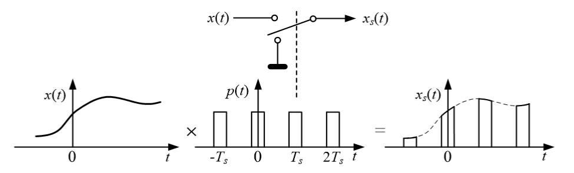
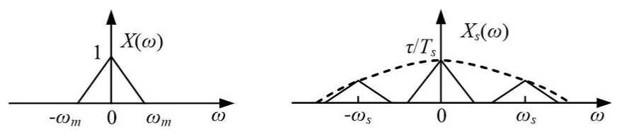
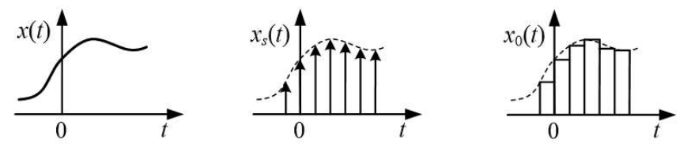
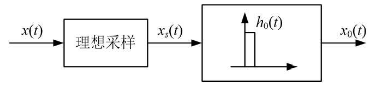
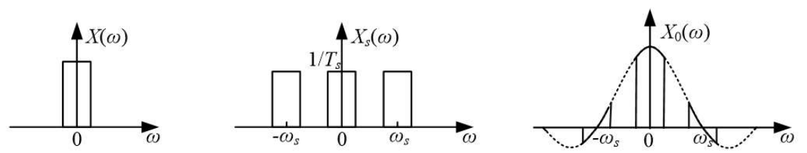
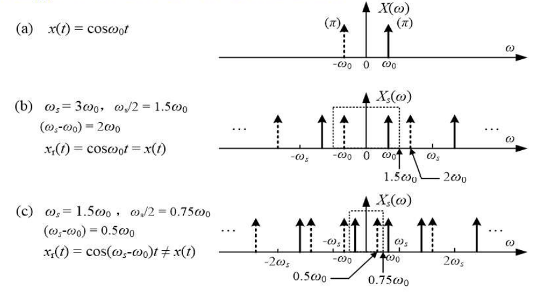
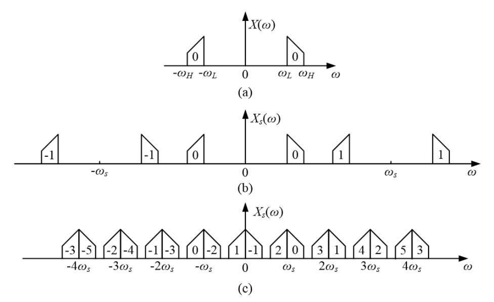

# 信号的抽样

## 时域抽样分析和时域抽样定理

### 理想抽样

理想抽样就是用周期冲激信号 $\delta_T(t)$ 乘待抽样信号 $x(t)$，获得抽样后信号 $x_s(t)$ 的过程。

设抽样间隔为 $T_s$（又称抽样周期），对应的抽样频率为 $f_s = \dfrac{1}{T_s}$（角频率为 $\omega_s = \dfrac{2\pi}{T_s}$）。抽样后信号 $x_s(t)$ 可表示为

$$
x_s(t) = x(t) \sum_{n = -\infty}^{\infty} \delta(t - n T_s)
$$

两边取傅里叶变换，并应用频域卷积定理，得理想抽样后信号 $x_s(t)$ 的频谱为

$$
X_s(\omega) = \frac{1}{T_s} \sum_{k = -\infty}^{\infty} X(\omega - k \omega_s)
$$

对连续时间信号进行时域理想抽样，会导致其频谱作周期延拓，延拓周期为抽样频率。

### 时域抽样定理

设 $x(t)$ 的频域带宽有限，最高频率为 $f_m$（$\omega_m = 2\pi f_m$）。如要实现对 $x(t)$ 的不失真抽样，抽样频率 $f_s$ 应满足如下条件

$$
\begin{cases}
    f_s \geqslant 2f_m, & \text{当 } X(\omega) \text{ 在 } \omega_m \text{ 处无频域冲激函数} \\
    f_s > 2f_m, & \text{当 } X(\omega) \text{ 在 } \omega_m \text{ 处有频域冲激函数}
\end{cases}
$$

### 理想抽样下的信号恢复与内插

利用截止频率为 $\dfrac{\omega_s}{2} \left(\dfrac{\omega_s}{2} > \omega_m\right)$、增益为 $T_s$ 的理想低通滤波器，可以从理想抽样后信号的频谱 $X_s(\omega)$ 中恢复抽样前信号频谱 $X(\omega)$，即

$$
X(\omega) = X_s(\omega) H_L(\omega)
$$

将上式用对应的时域函数表示

$$
x(t) = \sum_{n = -\infty}^{\infty} x(n T_s) \operatorname{Sa} \left[\frac{\omega_s}{2}(t - n T_s)\right]
$$

可以看到由抽样后信号 $x_s(t)$ 恢复 $x(t)$，本质上是函数内插问题。

连续时间函数 $x(t)$ 的确可以用离散时间点上的样值 $x(n T_s)$ 和内插函数 $\operatorname{Sa}\left[\dfrac{\omega_s}{2}(t - n T_s)\right]$ 表示。当样点间隔 $T_s \left(T_s = \dfrac{1}{f_s}\right)$ 满足抽样定理条件时，这一内插可以完全不失真地由 $x(n T_s)$ 重构信号 $x(t)$。

### 脉冲抽样

理想抽样中的冲激函数是不可实现的，一种比较可行的方法是用窄脉冲代替冲激信号。

上图中抽样后信号 $x_s(t)$ 可以表示为

$$
x_s(t) = x(t) p(t)
$$

两边取傅里叶变换，得

$$
X_s(\omega) = \frac{\tau}{T_s} \sum_{k = -\infty}^{\infty} \operatorname{Sa}\left(\frac{k \omega_s \tau}{2}\right) X(\omega - k \omega_s)
$$

其中，$\tau$ 为窄脉冲的脉宽。

脉冲抽样后信号的频谱 $X_s(\omega)$ 也是由 $X(\omega)$ 平移后叠加而成，但此时 $X_s(\omega)$ 已不是 $X(\omega)$ 的周期延拓。

当 $\omega_s$ 和 $k$ 确定后，$\dfrac{\tau}{T_s} \operatorname{Sa}\left(\dfrac{k \omega_s \tau}{2}\right)$ 是与 $\omega$ 无关的常数，即对于每个求和项，式中 $X(\omega - k \omega_s)$ 前面的系数都是常数。

因此尽管 $X_s(\omega)$ 不再为 $X(\omega)$ 的周期延拓，但 $X(\omega)$ 并没有发生畸变，抽样后的信号中仍含有不失真的 $X(\omega)$ 信息。

因此与理想抽样类似，可以利用低通滤波器从 $x_s(t)$ 中恢复 $x(t)$。

### 零阶保持抽样

脉冲抽样后信号 $x_s(t)$ 的脉冲顶部函数值是与 $x(t)$ 相同的，当脉冲很窄时，要通过电路实现脉冲抽样会相对困难。一种简单的处理方法是获取抽样瞬间的 $x(t)$ 值，并保持这一样本值直到下一个抽样时刻，形成如下图 $x_0(t)$ 所示的阶梯波形。这里 "零阶" 是指两个样点间用常数代替（变量的零次方），该抽样过程又称平顶抽样。

平顶抽样过程无法用简单的信号乘积模型表示，为了便于分析其频谱，该过程可以等效为用理想抽样后信号去激励一个冲激响应为窄脉冲 $h_0(t)$ 的系统。

输出信号 $x_0(t)$ 的频谱为

$$
\begin{split}
    X_0(\omega) &= H_0(\omega) X_s(\omega) \\
    &= \operatorname{Sa}\left(\frac{T_s \omega}{2}\right) e^{-\mathrm{j} \omega \frac{T_s}{2}} \sum_{n = -\infty}^{\infty} X(\omega - n \omega_s)
\end{split}
$$

上式即为抽样保持信号的频谱表达式。注意它和脉冲抽样频谱表达式不同，这里 $\operatorname{Sa}\left(\dfrac{T_s \omega}{2}\right) e^{-\mathrm{j} \omega \frac{T_s}{2}}$ 是频率的函数，它使 $X_0(\omega)$ 中包含的 $X(\omega)$ 发生了畸变。要想实现完全恢复原信号 $x(t)$，需要对上述畸变进行补偿。

### 单一频率正弦信号的欠抽样分析

对于带限于 $[0, \omega_m]$ 范围内的信号 $x(t)$，由于 $X(\omega)$ 通常在 $[0,\omega_m]$ 内非零，因此若 $\omega_s < 2\omega_m$，则抽样一定会导致频谱混叠。

但如果是单一频率正弦信号 $x(t) = \cos \omega_0 t$，由于 $X(\omega)$ 仅在 $\omega_0$ 处非零，即使 $\omega_s < 2\omega_m$，抽样也不会导致频谱混叠。

### 带通信号的抽样

带通信号是频谱分布在 $f_L$ 和 $f_H$ 之间的带限信号。如果抽样频率 $\omega_s \geqslant 2\omega_H$，显然可以实现频谱无重叠的抽样。若 $\omega_H$ 较大，则要求具有很高的抽样频率，应用中难以实现。

可以利用抽样后信号频谱混叠的特点，实现低于奈奎斯特频率（即 $2f_H$）的抽样。如下图所示

可以推出一般情况下，带通信号的抽样频率必须满足

$$
\frac{2f_H}{k} \leqslant f_s \leqslant \frac{2f_L}{k - 1}, \quad k = 1, 2, \dots, N
$$

其中，$N = \left\lfloor \dfrac{f_H}{f_H - f_L} \right\rfloor$。

## 频域抽样分析和频域抽样定理

### 频域抽样

记频域中由 $\delta(\omega)$ 构成的理想冲激抽样信号为 $\delta_{\omega_1}(\omega)$，即

$$
\delta_{\omega_1}(\omega) = \sum_{n = -\infty}^{\infty} \delta(\omega - n \omega_1)
$$

其中，$\omega_1$ 为抽样间隔，其傅里叶逆变换为

$$
\mathscr{F}^{-1}\{\delta_{\omega_1}(\omega)\} = \frac{1}{\omega_1} \sum_{n = -\infty}^{\infty} \delta(t - n T_1), \quad \left(\omega_1 = \frac{2\pi}{T_1}\right)
$$

设信号 $x(t)$ 是受限于 $[-t_m, t_m]$ 的时间有限信号，则其频谱将具有无限带宽。若对 $x(t)$ 的频谱 $X(\omega)$ 进行理想抽样，则抽样后频谱 $X_1(\omega)$ 为

$$
X_1(\omega) = X(\omega) \sum_{n = -\infty}^{\infty} \delta(\omega - n \omega_1)
$$

上式两边进行傅里叶逆变换，并利用时域卷积定理可得

$$
x_1(t) = \frac{1}{\omega_1} \sum_{n = -\infty}^{\infty} x(t - n T_1)
$$

上式表明频域的理想抽样导致时域信号的周期延拓。

### 频域抽样定理

当 $T_1 \geqslant 2t_m$ 或频域抽样间隔 $f_1$ 满足下列条件时，频域抽样不会造成时域的重叠，即 $X(\omega)$ 完全可以由 $X_1(\omega)$ 得到重构。

$$
\begin{cases}
    f_1 \leqslant \dfrac{1}{2t_m}, & \text{当 } x(t) \text{ 在 } t_m \text{ 处无冲激函数时} \\[2ex]
    f_1 < \dfrac{1}{2t_m}, & \text{当 } x(t) \text{ 在 } t_m \text{ 处有冲激函数时}
\end{cases}
$$

几点说明：

- 实际应用中的连续时间信号不会出现 $\delta(t - t_m)$，因此在实际应用中，频域抽样只有一个结论 $f_1 \leqslant \dfrac{1}{2t_m}$。但时域抽样的确会存在两种形式。

- 频域抽样是为了计算机能存储信号的频谱数据。无论是应用还是理论，都无需从离散谱恢复连续谱。因此频域抽样，一般不考虑抽样恢复问题。

- 从时域和频域抽样的讨论可以看到一个重要的对偶现象：

  - 对时域信号的理想抽样会导致频域信号的周期延拓；

  - 对频域信号的理想抽样会导致时域信号的周期延拓。