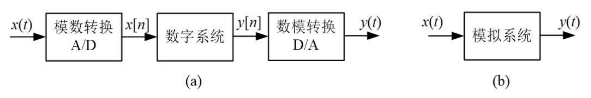
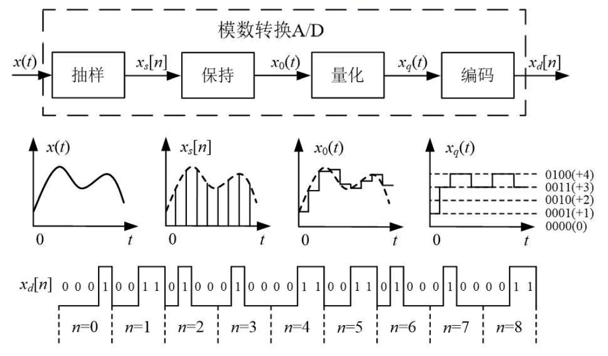
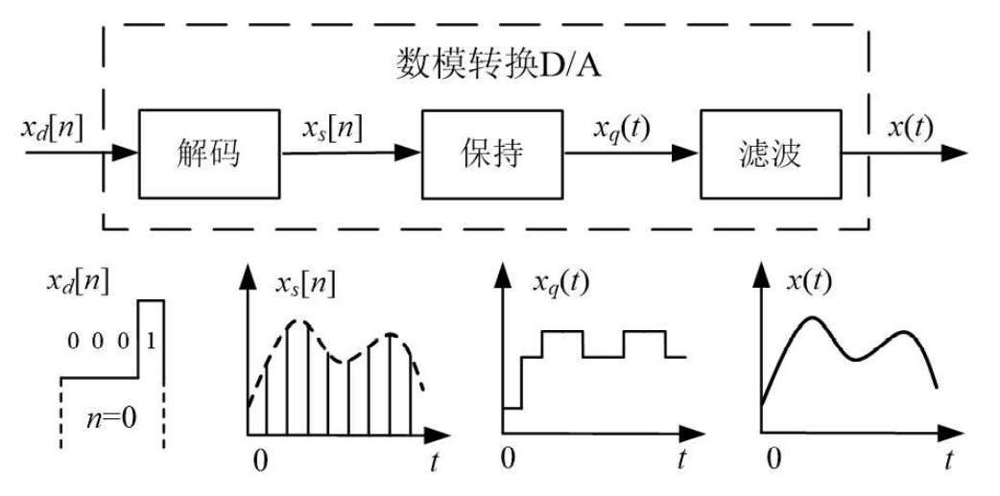
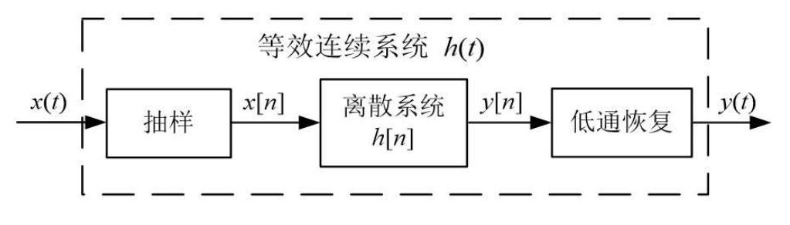
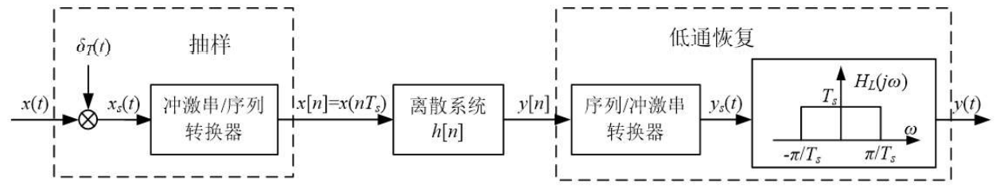

# 模拟信号的数字处理系统

通过抽样将模拟信号转化为离散时间信号后，就可以通过数字处理系统来等效实现原来模拟系统的功能。

- 模数转换系统

  

  模数转换系统通常由上图所示的几个部分组成。抽样电路每隔 $T_s$ 秒采得一个信号值，保持电路将该值一直保持到下个抽样时刻到来。经抽样、保持电路后，模拟输入 $x(t)$ 转变为图中所示的抽样后信号 $x_0(t)$。

  由于系统的输入信号 $x(t)$ 是任意的，因而抽样后 $x_0(t)$ 的函数取值可能是实数范围内的任意一个值。量化器则将 $x_0(t)$ 的函数取值进行离散化，从而得到量化后的信号 $x_q(t)$。图中 $x_q(t)$ 坐标上的虚线即表示量化时的 "刻度"（称为量化电平）。

  量化电平的大小可用二进制数表示。编码器则根据量化电平的划分，将 $x_q(t)$ 转变成用 $0/1$ 表示的数字序列 $x_d[n]$。

- 数模转换系统

  

  数模转换是模数转换的逆过程，系统组成如上图所示。从图中各点信号波形上可以看出每个系统单元的功能。最后一个环节 "滤波" 将保持电路的输出信号转变成模拟信号。

由于编码、解码及保持单元在理论上不会改变信号所含的信息，且量化的影响可以归为误差分析，因此在很多文件中，通常只提取 "模拟信号数字处理系统" 中的关键单元，形成下图所示的系统框图，以突出核心问题。

然而，上图中的抽样环节和前面讨论的抽样分析并不能对应，因为在抽样分析中，抽样后信号是连续时间信号 $x_s(t)$，并不是离散序列 $x[n]$。同样，在前面讨论的抽样恢复中，考虑的也是从连续时间信号 $x_s(t)$ 恢复 $x(t)$，并不是从离散样值恢复。

为此，可以将上图改为如下图所示的系统框图，引入 "冲激串/序列转换器" 和 "序列/冲激串转换器"，将连续域和离散域进行了 "隔离"。

"冲激串/序列转换器" 之前的抽样部分和前面讨论的理想抽样对应了起来，"序列/冲激串转换器" 之后的低通滤波器和前面讨论的抽样恢复对应了起来。

**注1**：引入的两个 "转换器" 是无法用电路实现的。是为了便于理解而人为定义的系统单元。

**注2**：连续域分析理论和离散域分析理论是两套体系。连续域分析理论不能分析离散时间序列，离散域分析理论也无法分析连续时间信号。这就是为什么在前面的抽样分析中，抽样后信号只能是连续时间信号 $x_s(t)$，而不能是离散序列 $x[n]$。
