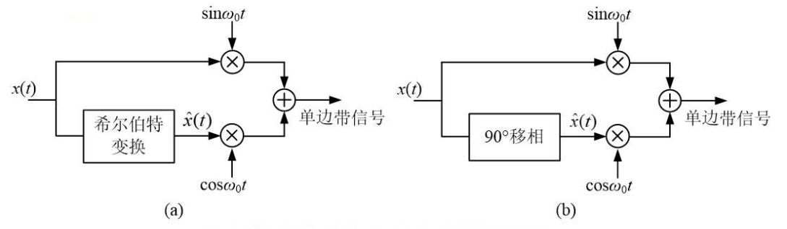
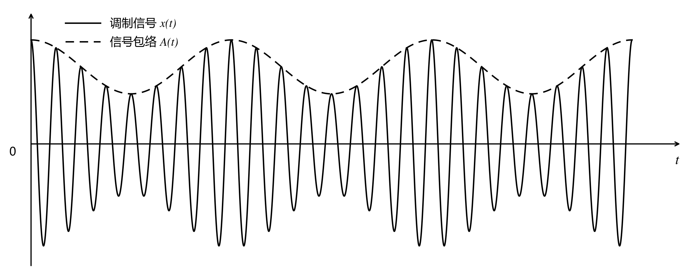

# 希尔伯特变换

## 希尔伯特变换及其有关概念

### 希尔伯特变换的定义

记信号 $x(t)$ 的希尔伯特变换为 $\hat{x}(t)$，希尔伯特正变换和逆变换的定义如下：

- 正变换：

  $$
  \hat{x}(t) = \mathscr{H} \{x(t)\} = x(t) * \frac{1}{\pi t} = \frac{1}{\pi} \int_{-\infty}^{\infty} \frac{x(\tau)}{t - \tau} \, \mathrm{d} \tau
  $$

- 逆变换：

  $$
  x(t) = \mathscr{H}^{-1} \{\hat{x}(t)\} = \hat{x}(t) * \frac{1}{-\pi t} = \frac{1}{-\pi} \int_{-\infty}^{\infty} \frac{\hat{x}(\tau)}{t - \tau} \, \mathrm{d} \tau
  $$

**注**：希尔伯特变换是同域变换，即 $\hat{x}(t)$ 和 $x(t)$ 都是时域函数。

由于卷积满足交换律，因此希尔伯特变换定义式又可以写为：

- 正变换：

  $$
  \hat{x}(t) = \frac{1}{\pi} \int_{-\infty}^{\infty} \frac{x(t - \tau)}{\tau} \, \mathrm{d} \tau
  $$

- 逆变换：

  $$
  x(t) = \frac{1}{-\pi} \int_{-\infty}^{\infty} \frac{\hat{x}(t - \tau)}{\tau} \, \mathrm{d} \tau
  $$

### 希尔伯特变换的频域关系

由于 $\dfrac{1}{\pi t} \xleftrightarrow{\mathscr{F}} -\mathrm{j} \operatorname{sgn}(\omega)$，对希尔伯特变换对两边取傅里叶变换得：

$$
\hat{X}(\omega) = X(\omega) \cdot \mathscr{F}\left\{\frac{1}{\pi t}\right\} = -\mathrm{j} X(\omega) \operatorname{sgn}(\omega)
$$

两边同乘 $\mathrm{j} \operatorname{sgn}(\omega)$，则有：

$$
\mathrm{j} \operatorname{sgn}(\omega) \hat{X}(\omega) = -\mathrm{j}^2 X(\omega) \operatorname{sgn}^2(\omega) = X(\omega)
$$

整理可得希尔伯特变换的频域关系：

$$
\hat{X}(\omega) = -\mathrm{j} X(\omega) \operatorname{sgn}(\omega)
$$

$$
X(\omega) = \mathrm{j} \hat{X}(\omega) \operatorname{sgn}(\omega)
$$

### 希尔伯特变换的信号处理实质—— $90^\circ$ 移相

将希尔伯特频域关系写为如下形式：

$$
\hat{X}(\omega) = -\mathrm{j} X(\omega) \operatorname{sgn}(\omega) = \begin{cases}
    -\mathrm{j} X(\omega), & \omega > 0 \\
    0, & \omega = 0 \\
    \mathrm{j} X(\omega), & \omega < 0
\end{cases} = \begin{cases}
    |X(\omega)| e^{\mathrm{j} \varphi(\omega)} e^{-\mathrm{j} \frac{\pi}{2}}, & \omega > 0 \\
    0, & \omega = 0 \\
    |X(\omega)| e^{\mathrm{j}\varphi(\omega)} e^{\mathrm{j}\frac{\pi}{2}}, & \omega < 0
\end{cases}
$$

由上式可知：

- 正频率分量的幅角因子乘 $e^{-\mathrm{j} \frac{\pi}{2}}$，或者说相位增加 $-\dfrac{\pi}{2}$。
- 负频率分量的幅角因子乘 $e^{\mathrm{j} \frac{\pi}{2}}$，或者说相位增加 $\dfrac{\pi}{2}$。

即对 $x(t)$ 进行希尔伯特变换，本质上就是对每个频率分量进行 $90^\circ$ 移相，直流信号的希尔伯特变换为 $0$。

## 解析信号

### 用希尔伯特变换构建单边谱信号——解析信号

$$
X_a(\omega) = X(\omega) + \mathrm{j} \hat{X}(\omega) = X(\omega)[1 + \operatorname{sgn}(\omega)] = \begin{cases}
    2X(\omega), & \omega > 0 \\
    0, & \omega < 0
\end{cases}
$$

可见 $X_a(\omega)$ 是一个单边谱，即只在 $\omega > 0$ 时有非零值。

对上式两边取傅里叶逆变换，则有：

$$
x_a(t) = x(t) + \mathrm{j} \hat{x}(t)
$$

如果用 $x(t)$ 及其希尔伯特变换构成上式所述的复数信号 $x_a(t)$，那么 $x_a(t)$ 的频谱将是单边的。$x_a(t)$ 被称为解析信号（Analytic Signal）。

前面的讨论指出 $\hat{x}(t)$ 的直流分量为零，但由解析信号定义式可知其直流分量并不为零，应该等于 $x(t)$ 的直流分量幅值。因此，单边谱与 $X(\omega)$ 关系的准确含义应该为：

$$
X_a(\omega) = \begin{cases}
    2X(\omega), & \omega > 0 \\
    X(\omega), & \omega = 0 \\
    0, & \omega < 0
\end{cases}
$$

### 单边带调制——希尔伯特变换和解析信号的应用

当对 $x(t)$ 进行乘法调制后（即 $x(t) \cos \omega_0 t$），$X(\omega)$ 中 $\omega < 0$ 的部分被搬移至 $\omega > 0$ 区域，导致调制后信号的物理带宽增加一倍。然而，实信号的幅频和相频分别具有偶对称性和奇对称性。也就是说，当已知 $\omega > 0$ 部分的 $X(\omega)$，则完全可以确定 $\omega < 0$ 部分的 $X(\omega)$。如果发送端在发射前能够构造一个单边谱信号，则可以节省无线通信系统的频率资源。

通信系统中的单边带调制技术则源于这一想法。下图是单边带调制系统框图（左右两图等价），它利用三角函数的正交性将复数信号的实部和虚部叠加在一起传输。

### 包络提取——解析信号的应用

一个信号的幅度可能有缓慢变化的过程。例如在下图中，用虚线勾画出了正弦信号幅度的缓变过程，这个虚线即所谓的信号包络。

振幅缓变的正弦信号可以表示为：

$$
x(t) = A(t) \cos \omega_0 t
$$

其中 $A(t)$ 反映幅度的缓变，即为 $x(t)$ 的包络，对任意 $t$，$A(t) > 0$。

对上式进行希尔伯特变换。由于希尔伯特变换是对信号频率分量进行 $90^\circ$ 相移，即正弦信号的四分之一周期平移。在 $\cos \omega_0 t$ 的四分之一周期内，可以认为 $A(t)$ 近似不变（常数）。因此，只对上式中 $\cos \omega_0 t$ 进行希尔伯特变换即可，所以：

$$
\hat{x}(t) = A(t) \sin \omega_0 t
$$

用上述 $x(t)$ 和 $\hat{x}(t)$ 构成解析信号 $x_a(t)$ 

$$
x_a(t) = x(t) + \mathrm{j} \hat{x}(t) = A(t) \cos \omega_0 t + \mathrm{j} A(t) \sin \omega_0 t = A(t) e^{\mathrm{j} \omega_0 t}
$$

从而 $x_a(t)$ 的模为 $A(t)$。因此，利用解析信号，可以提取幅度调制信号的包络。

---

上述讨论中，快变化信号是正弦信号。如果快变化信号为非正弦的恒幅信号 $f(t)$，可以建模为：

$$
x(t) = A(t) f(t)
$$

其中 $f(t)$ 是快变化的信号主体，$A(t)$ 是缓变的信号包络，$A(t) > 0$。

$x(t)$ 的希尔伯特变换为：

$$
\hat{x}(t) = A(t) \hat{f}(t)
$$

构成的解析信号为：

$$
x_a(t) = A(t)[f(t) + \mathrm{j} \hat{f}(t)]
$$

由于希尔伯特变换的实质是移相，因此当 $f(t)$ 为恒幅信号时，$\hat{f}(t)$ 也为恒幅信号，从而有：

$$
|x_a(t)| = A(t) \sqrt{f^2(t) + \hat{f}^2(t)} = C A(t)
$$

其中 $C = \sqrt{f^2(t) + \hat{f}^2(t)}$ 为常数，$A(t) > 0$。

上式表明，对于非正弦情况，也可以用解析信号模求解包络。
