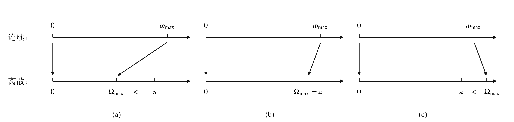

# 连续时间频率与离散时间频率

## 连续时间频率与离散时间频率之间的关系

离散时间角频率的概念可从连续正弦信号的抽样过程直接获得。若以间隔 $T_s$ 对连续时间正弦信号 $\sin \omega t$ 进行抽样，则抽样后离散正弦序列为 $\sin \omega n T_s = \sin \Omega n$，因此有

$$
\Omega = \omega T_s \quad \text{或} \quad \Omega = 2\pi \frac{f}{f_s}
$$

所以，如果离散序列来源于对连续时间信号的抽样，离散时间频率的物理含义是连续时间频率和抽样频率之比。上式在连续信号频率和离散信号频率之间建立了一个映射。根据最高信号频率 $f_{\max}$ 和抽样频率 $f_s$ 之间的关系，这一映射会出现如下三种情况：

只有当 $\Omega_{\max} \leqslant \pi$ 时，才满足模拟信号数字处理的必要条件：不失真抽样。整个 $[0,\pi]$ 区间的 $\Omega$ 取值范围是实现数字系统的所有 "可用频率资源"。

当某一模拟频率 $f$ 映射后的数字角频率出现 $\Omega > \pi$，则表明一定有抽样失真。此时会出现频率高的模拟信号在抽样后成为低频甚至直流数字信号。

## 连续时间和离散时间信号频谱之间的关系

设连续时间信号 $x(t)$ 带限于 $[-\omega_m, \omega_m]$（假设 $\omega_s > 2\omega_m$）。

1. 先考虑 $x(t)$ 的理想抽样后信号 $x_s(t)$ 的频谱

   理想抽样后信号

   $$
   x_s(t) = x(t) \sum_{n=-\infty}^{\infty} \delta(t - n T_s) = \sum_{n=-\infty}^{\infty} x(n T_s) \delta(t - n T_s)
   $$

   两边取傅里叶变换得

   $$
   X_s(\omega) = \sum_{n=-\infty}^{\infty} x(n T_s) \mathscr{F}\{\delta(t - n T_s)\} = \sum_{n=-\infty}^{\infty} x(n T_s) e^{-\mathrm{j} n T_s \omega} = \frac{1}{T_s} \sum_{n=-\infty}^{\infty} X(\omega - n \omega_s)
   $$

   上式是用 $x(t)$ 抽样点函数值 $x(n T_s)$ 表示的抽样后信号 $x_s(t)$ 的频谱。

2. 再考虑 $x(t)$ 抽样点上样值构成的离散序列 $x[n] = x(n T_s) = \left. x(t) \right|_{t = n T_s}$，   其频谱为

   $$
   X(e^{\mathrm{j}\Omega}) = \mathrm{DTFT}\{x[n]\} = \sum_{n=-\infty}^{\infty} x[n] e^{-\mathrm{j}\Omega n}
   $$

3. 只需令 $\Omega = \omega T_s$，则序列 $x[n]$ 的频谱与对应的连续时间抽样后信号 $x_s(t)$ 的频谱相同，即有

   $$
   X(e^{\mathrm{j}\Omega}) = \left. X_s(\omega) \right|_{\omega = \frac{\Omega}{T_s}} = \left. \frac{1}{T_s} \sum_{n=-\infty}^{\infty} X(\omega - n \omega_s) \right|_{\omega = \frac{\Omega}{T_s}}
   $$

   上式即为 $x(t)$ 频谱和其抽样后序列 $x[n]$ 频谱之间的关系。

总结：

- $x[n]$ 的频谱是 $x(t)$ 频谱作周期为 $\omega_s$ 的周期延拓后，再进行 $\omega = \Omega/T_s$ 变量代换构成的。

- 如果 $x(t)$ 的抽样满足不失真抽样要求，则在 $x[n]$ 的频谱中包含一个完整的且不失真的 $x(t)$ 的频谱结构。

- 频率映射关系 $\omega = \Omega/T_s$ 即为连续时间频率和离散时间频率之间的关系。它将抽样角频率 $\omega_s$ 映射到 $2\pi$，$\omega_s/2$ 映射到 $\pi$，最高模拟频率 $\omega_m$ 映射到 $\Omega_m$。

## 连续时间和离散时间频率响应函数之间的关系

由上方的结论，有

$$
H(e^{\mathrm{j}\Omega}) = \left. H_s(\omega) \right|_{\omega = \frac{\Omega}{T_s}} = \left. \frac{1}{T_s} \sum_{n=-\infty}^{\infty} H(\omega - n \omega_s) \right|_{\omega = \frac{\Omega}{T_s}}
$$

其中 $H(\omega)$ 是连续系统的频率响应，$H_s(\omega)$ 是对 $h(t)$ 理想抽样后信号 $h_s(t)$ 的频谱，$H(e^{\mathrm{j}\Omega})$ 是 $h(t)$ 的抽样点序列 $h[n]$ 的频谱。

冲激响应不变法：如果模拟滤波器的冲激响应 $h(t)$ 为已知，$h(t)$ 抽样值构成的序列 $h[n]$ 则是对应的数字滤波器的冲激响应，因此按照下列过程可以从模拟滤波器得到对应的数字滤波器：

$$
h(t) = \mathscr{F}^{-1}\{H(\omega)\} \;\to\; h[n] = \left. h(t) \right|_{t = n T_s} \;\to\; H(e^{\mathrm{j}\Omega}) = \mathrm{DTFT}\{h[n]\}
$$
