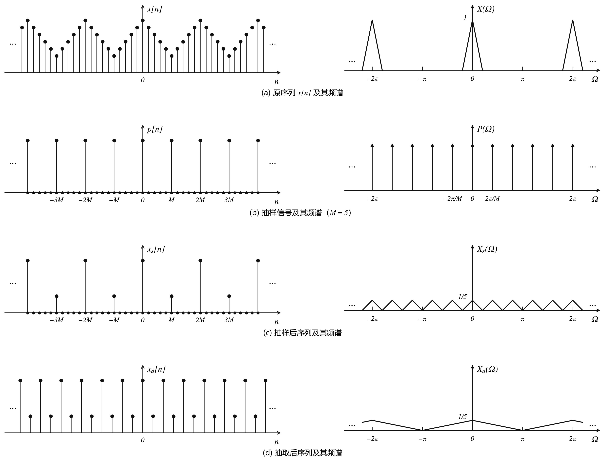

# 序列内插和序列抽取的频谱分析

## 序列内插零和抽取的定义

- **内插零**

  对于给定序列 $x[n]$，$M$ 倍内插零后构成的新序列 $x_{\mathrm{i}}[n]$ 定义为

  $$
  x_{\mathrm{i}}[n] = \begin{cases}
  x[n/M], & n \text{ 为 } M \text{ 的整数倍} \\
  0, & n \text{ 不为 } M \text{ 的整数倍}
  \end{cases}
  $$

  即在原序列 $x[n]$ 的每两个样值之间内插 $M-1$ 个零。

- **抽取**

  对于给定序列 $x[n]$，$M$ 倍抽取后构成的新序列 $x_{\mathrm{d}}[n]$ 定义为

  $$
  x_{\mathrm{d}}[n] = x[nM]
  $$

  即每隔 $M-1$ 个样值从 $x[n]$ 中抽取一个样值后构成的新序列 $x_{\mathrm{d}}[n]$。

## 序列内插零后的频谱

由 $\mathrm{DTFT}$ 的定义有

$$
X_{\mathrm{i}}(e^{\mathrm{j}\Omega}) = X(e^{\mathrm{j} M \Omega})
$$

上式表明，$M$ 倍内插零后的序列 $x_{\mathrm{i}}[n]$ 的频谱是原序列 $x[n]$ 频谱的 $M$ 倍压缩。

这和连续时间信号的尺度变换特性类似，但有两点区别：

- 连续时间时域扩展后，信号的变化速度变慢，信号频谱的高频分量将减少；离散序列在两个相邻样值之间内插零后，一般都是加快了序列的变化速度（尤其是在内插零的个数较少时）。因此内插零后序列频谱中的高频分量将增加。

- 连续信号时域扩展 $M$ 倍后，信号的能量将增加 $M$ 倍，因此时域扩展后频谱将有 $M$ 倍的增幅；离散序列内插零后，信号的能量维持不变，因此内插零后频谱也不会产生 $M$ 倍的增幅。

## 序列丢弃零后的频谱

如果将 $x_{\mathrm{i}}[n]$ 看作原序列，则 $x[n]$ 是将 $x_{\mathrm{i}}[n]$ 每丢弃 $M-1$ 个零后取一个样值而形成的序列。按习惯将原序列记为 $x[n]$，丢弃后的序列可记为 $x_{\mathrm{l}}[n]$，即有

$$
x_{\mathrm{l}}[n] = x[Mn]
$$

由 $M$ 倍内插零的频谱式可推知

$$
X_{\mathrm{l}}(e^{\mathrm{j}\Omega}) = X(e^{\mathrm{j}\Omega / M})
$$

即 $M$ 倍丢弃零后序列的频谱是原序列频谱的 $M$ 倍扩展。

## 序列 "抽样" 后的频谱

**注**：此处用 $X(\Omega)$ 表示 $X(e^{\mathrm{j}\Omega})$。

**注**：此处 "抽样" 指以间隔 $M$ 对序列进行理想采样——保留采样点处的样值，其余位置置零，但不丢弃任何样点。这与 "抽取" 不同，后者在采样后会将零值样点丢弃，从而缩减序列长度。

设 $p[n]$ 为抽样间隔为 $M$ 的理想抽样函数。抽样后信号 $x_s[n] = x[n] p[n]$ 可表示为

$$
x_s[n] = x[n] \sum_{k = -\infty}^{\infty} \delta[n - kM]
$$

两边取傅里叶变换，并应用频域卷积定理，得理想抽样后信号 $x_s[n]$ 的频谱为

$$
X_s(\Omega) = \frac{1}{2\pi} \int_{2\pi} X(\Omega - \lambda) P(\lambda) \, \mathrm{d}\lambda
$$

$p[n]$ 的 $\mathrm{DTFT}$ 为

$$
P(\Omega) = \frac{2\pi}{M} \sum_{k = -\infty}^{\infty} \delta\!\left(\Omega - k\frac{2\pi}{M}\right)
$$

在 $[0,2\pi]$ 区间内 $P(\Omega)$ 只有 $M$ 个样值，因此其求和极限可改写为

$$
P(\Omega) = \frac{2\pi}{M} \sum_{k = 0}^{M - 1} \delta\!\left(\Omega - k\frac{2\pi}{M}\right)
$$

代入 $X_s$ 的计算式中得

$$
X_s(\Omega) = \frac{1}{M} \sum_{k = 0}^{M - 1} X\!\left(\Omega - k\frac{2\pi}{M}\right)
$$

改用 $X(e^{\mathrm{j}\Omega})$ 形式

$$
X_s(e^{\mathrm{j}\Omega}) = \frac{1}{M} \sum_{k = 0}^{M - 1} X\!\left(e^{\mathrm{j}(\Omega - 2\pi k/M)}\right)
$$

上式表明，以时域间隔 $M$ 对序列 $x[n]$ 进行 "理想抽样" ，将导致其频谱作 $M-1$ 次周期延拓。

**注**：对给定序列，如果 "抽样" 间隔过大或 $x[n]$ 不为频域带限序列，抽样后序列频谱会发生混叠。（和连续时间抽样一样的频谱混叠的问题）

## 序列抽取后的频谱

序列抽取可以视作两步实现的：

1. 序列的 "理想抽样"（即前一部分所述）

   得到序列 $x_s[n]$ 的频谱为

   $$
   X_s(e^{\mathrm{j}\Omega}) = \frac{1}{M} \sum_{k = 0}^{M - 1} X\!\left(e^{\mathrm{j}(\Omega - 2\pi k/M)}\right)
   $$

2. 将抽样后序列 $x_s[n]$ 中介于两次抽样之间的零值丢弃。

   得到序列 $x_{\mathrm{d}}[n]$ 的频谱为

   $$
   X_{\mathrm{d}}(\Omega) = X_s(e^{\mathrm{j}\Omega / M}) = \frac{1}{M} \sum_{k = 0}^{M - 1} X\!\left(e^{\mathrm{j}(\Omega - 2\pi k)/M}\right)
   $$

对序列进行 $M$ 倍抽取后，频谱先以间隔 $\dfrac{2\pi}{M}$ 作 $M-1$ 次周期延拓，再作 $M$ 倍的扩展。

如果频谱不是带限于 $\dfrac{\pi}{M}$ 的信号，则会发生频谱混叠。
