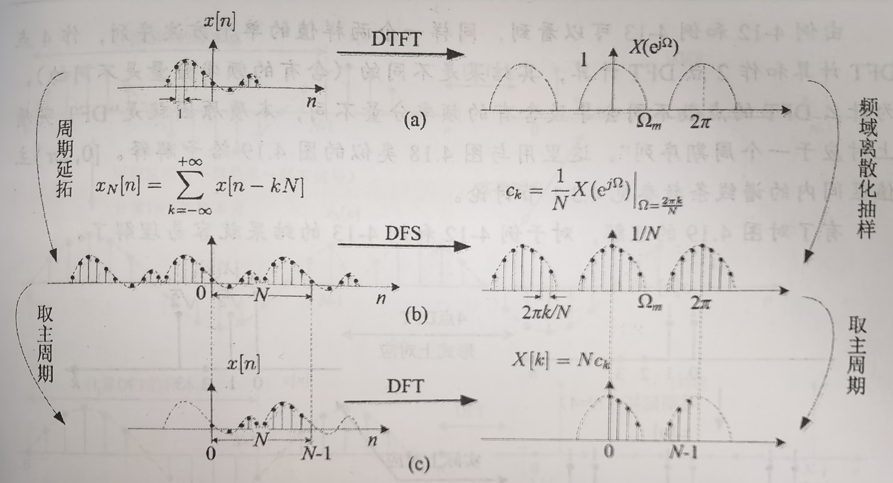

# 离散傅里叶变换（$\mathrm{DFT}$）

## 序列频谱的离散化和 $\mathrm{DFT}$ 的定义

### $\mathrm{DFT}$ 正变换

设 $x[n]$ 是仅在 $[0,N-1]$ 区间有非零值的有限长序列，其频谱为 $X(e^{\mathrm{j}\Omega})$。对 $X(e^{\mathrm{j}\Omega})$ 在 $[0, 2\pi)$ 区间上进行离散化，则各样点角频率为 $\Omega_k = k \dfrac{2\pi}{N}$。因此，由 $\mathrm{DTFT}$ 变换公式可定义：

$$
X[k] = \left. X(e^{\mathrm{j}\Omega}) \right|_{\Omega = k\frac{2\pi}{N}} = \left. \sum_{n = -\infty}^{\infty} x[n] e^{-\mathrm{j}\Omega n} \right|_{\Omega = k\frac{2\pi}{N}} = \sum_{n = 0}^{N - 1} x[n] e^{-\mathrm{j} k \frac{2\pi}{N} n}
$$

由于对 $X(e^{\mathrm{j}\Omega})$ 的离散化只产生 $N$ 个样点，因此明确 $k$ 的取值范围后的表达式为：

$$
X[k] = \sum_{n = 0}^{N - 1} x[n] e^{-\mathrm{j} k \frac{2\pi}{N} n}, \quad (k = 0, 1, 2, \dots, N - 1)
$$

上式即为 $\mathrm{DFT}$ 正变换的定义。

**注**：

- 谱线间隔为 $\Delta\Omega = 2\pi/N$。去除 $X[0]$ 后其余谱线关于 $\Omega = \pi$ 对称。

  $\mathrm{DFT}$ 是以刚好不产生时域混叠的抽样间隔对有限长序列的频谱进行抽样。

- $X[0]$ 是有限长序列 $x[n]$ 的直流分量，$X[1]$ 是基波分量，$X[2]$ 是二次谐波分量，以此类推。

- $x[n]$ 含有的最高频率分量是最靠近但不超过 $\pi$ 的谱线 $X[k]$。

  - 当 $N$ 为偶数时，最高频率谱线位于 $\Omega = \pi$ 处，对应于 $k = N/2$。物理谱共含有 $(1 + N/2)$ 条谱线。

    由于当 $N$ 为偶数时，$\Omega = 0$ 和 $\Omega = \pi$ 各有一条谱线，即物理谱包括了直流和数字序列最高频点 $\pi$，因此 $N$ 为偶数是比较合适的取值，$\mathrm{FFT}$ 中最常见的情况就是 $N=2^M$。

  - 当 $N$ 为奇数时，最高频率谱线位置是 $k = \lfloor N/2 \rfloor$。最高数字角频率小于 $\pi$。物理谱共含有 $(1 + \lfloor N/2 \rfloor)$ 条谱线。

- $x[n]$ 频谱的主值区间不包括 $\Omega = 2\pi$ 处的谱线，因为 $\Omega = 2\pi$ 就是直流分量 $X[0]$，属于 $X(e^{\mathrm{j}\Omega})$ 的下一个 $2\pi$ 周期。

### $\mathrm{DFT}$ 逆变换

$$
x[n] = \frac{1}{N} \sum_{k = 0}^{N - 1} X[k] e^{\mathrm{j} k \frac{2\pi}{N} n}, \quad (n = 0, 1, 2, \dots, N - 1)
$$

上式即为 $\mathrm{DFT}$ 逆变换定义式。

为表示方便，正逆变换运算可表示为：

$$
X[k] = \mathrm{DFT}\{x[n]\}; \quad x[n] = \mathrm{IDFT}\{X[k]\}
$$

由于 $\mathrm{DFT}$ 的正逆变换都是有限项求和，所以只要时域和频域样值不为无穷大，求和总是收敛的。

## $\mathrm{DFT}$ 与 $\mathrm{DFS}$ 的关系

比较 $c_k$ 的定义式（这里将 $x_N[n]$ 在区间 $[0,N-1]$ 内的序列记为 $x[n]$）：

$$
c_k = \frac{1}{N} \sum_{n = 0}^{N - 1} x[n] e^{-\mathrm{j} k \frac{2\pi}{N} n}, \quad (k = 0, 1, 2, \dots, N - 1)
$$

与 $\mathrm{DFT}$ 的定义式：

$$
X[k] = \sum_{n = 0}^{N - 1} x[n] e^{-\mathrm{j} k \frac{2\pi}{N} n}, \quad (k = 0, 1, 2, \dots, N - 1)
$$

可以看到：

$$
X[k] = N c_k, \quad (k = 0, 1, 2, \dots, N - 1)
$$

**结论**：

- $\mathrm{DFT}$ 本质上就是 $\mathrm{DFS}$。

- $\mathrm{DFT}$ 是利用周期延拓序列 $x_N[n]$ 在 $[0,2\pi)$ 区间内的 $\mathrm{DFS}$ 系数表征连续频谱 $X(e^{\mathrm{j}\Omega})$，只是在幅度上相差一个系数。

- $X[k]$ 表面上是与非周期序列 $x[n]$ 构成一对变换对（$\mathrm{DFT}$ 和 $\mathrm{IDFT}$），事实上 $X[k]$ 直接关联的是周期序列 $x_N[n]$。这一结论强调的是：当考虑频域中对 $X[k]$ 的操作如何影响其对应的时域序列时，这个 "对应的时域序列" 是 $x_N[n]$，而不是 $x[n]$。或者说隐含构成实质性对应关系的是 $X[k]$ 和 $x_N[n]$，不是 $X[k]$ 和 $x[n]$。

- $X[k]$、$X(e^{\mathrm{j}\Omega})$ 和 $c_k$ 之间的关系归纳如下：

  - $\mathrm{DFT}$ 和 $\mathrm{DTFT}$：$X[k] = \left. X(e^{\mathrm{j}\Omega}) \right|_{\Omega = k\frac{2\pi}{N}}$（$X[k]$ 是对 $X(e^{\mathrm{j}\Omega})$ 的抽样）。

  - $\mathrm{DFT}$ 和 $\mathrm{DFS}$：$X[k] = N c_k$（$X[k]$ 和一个周期内的 $c_k$ 本质上相同）。

  - $\mathrm{DFS}$ 和 $\mathrm{DTFT}$：$c_k = \left. \frac{1}{N} X(e^{\mathrm{j}\Omega}) \right|_{\Omega = k\frac{2\pi}{N}}$（$c_k$ 本质上也是 $X(e^{\mathrm{j}\Omega})$ 的抽样）。

## $\mathrm{DFT}$ 的性质—— $X[k]$ 的特性

- **性质 1（周期性）**

  $X[k]$ 是以 $N$ 为周期的周期函数，即有：

  $$
  X[k] = X[k + N]; \quad X[-k] = X[N - k]
  $$

- **性质 2（共轭对称性）**

  设 $X[k] = \mathrm{DFT}\{x[n]\}$，若 $x[n]$ 为实数序列，则：

  $$
  X^*[k] = X[-k] = X[N - k]
  $$

  若 $x[n]$ 为复数序列，则：

  $$
  \mathrm{DFT}\{x^*[n]\} = X^*[-k] = X^*[N - k]
  $$

- **性质 3（奇偶性）**

  若 $x[n]$ 为实数序列时，则 $X[k]$ 的模是 $k$ 的偶函数，$X[k]$ 的相位是 $k$ 的奇函数；$X[k]$ 的实部是 $k$ 的偶函数，$X[k]$ 的虚部是 $k$ 的奇函数。

  $$
  |X[k]| = |X[-k]| = |X[N - k]|
  $$

  $$
  -\varphi[k] = \varphi[-k] = \varphi[N - k]
  $$

  $$
  X_{R}[k] = X_{R}[-k] = X_{R}[N - k]
  $$

  $$
  -X_{I}[k] = X_{I}[-k] = X_{I}[N - k]
  $$

详细推导过程及更多性质见[共轭对称性分析](../3.连续时间傅里叶分析/共轭对称性分析.md)。

### 帕斯瓦尔 (Parseval) 定理

时域信号与频域信号具有相同的能量，即：

$$
\sum_{n = 0}^{N - 1} |x[n]|^2 = \frac{1}{N} \sum_{k = 0}^{N - 1} |X[k]|^2
$$

## $\mathrm{DFT}$ 的性质——变换的性质

### 时域圆周卷积定理——系统响应的 $\mathrm{DFT}$ 求解

- **性质 1（时域圆周卷积定理）**

  若 $y_c[n] = (x_N[n] * h_N[n]) R[n]$，则：

  $$
  Y_c[k] = \mathrm{DFT}\{y_c[n]\} = X[k] H[k]
  $$

---

虽然有时域卷积定理，但不能简单地套用传统系统响应变换域求解方法，原因在于 $X[k]H[k]$ 对应的不是线性卷积，而是圆周卷积。

用 $\mathrm{DFT}$ 求解系统响应的步骤：

1. 取 $N \geqslant N_x + N_h - 1$，补零将 $x[n]$ 和 $h[n]$ 变成长度为 $N$ 的两个等长序列。

2. 分别求补零后两个等长序列的 $N$ 点 $\mathrm{DFT}$。

3. 求乘积 $X[k]H[k]$。

4. 求 $y_c[n] = \mathrm{IDFT}\{X[k]H[k]\}$。

5. 在 $y_c[n]$ 中取前 $N_x + N_h - 1$ 个样值，即为所求响应序列。

### 频移特性——频谱搬移的数字系统实现

- **性质 2（频移特性）**

  若 $\mathrm{DFT}\{x[n]\} = X[k]$，则：

  $$
  \mathrm{DFT}\{x[n] e^{\mathrm{j} m \frac{2\pi}{N} n}\} = X[k - m] R[k]
  $$

  其中，$X[k]$ 为周期的，$R[k]$ 是主值区间窗函数，限定 $X[k - m]$ 为主值区间 $[0,N-1]$ 内的样值。

### 时移特性—— $\mathrm{DFT}$ 的时域序列理解

由于 $\mathrm{DFT}$ 的求和范围在 $[0,N-1]$ 区间，参与求和计算的非零样值在频移前后就有可能发生变化，有的样值可能移出了求和范围，也可能有新样值移进了求和范围。

将平移前后参与 $\mathrm{DFT}$ 计算的非零样值集合相同表示为：

$$
\operatorname{set}\{x[n - m]\} = \operatorname{set}\{x[n]\}
$$

---

- **性质 3（时移特性）**

  设 $\mathrm{DFT}\{x[n]\} = X[k]$，

  - 若 $\operatorname{set}\{x[n - m]\} = \operatorname{set}\{x[n]\}$（$m > 0$），则：

    $$
    x[n - m] \xrightarrow{\mathrm{DFT}} X[k] e^{-\mathrm{j} k \frac{2\pi}{N} m}
    $$

  - 若 $\operatorname{set}\{x[n - m]\} \ne \operatorname{set}\{x[n]\}$，则：

    $$
    x[n - m] \xrightarrow{\mathrm{DFT}} e^{-\mathrm{j} k \frac{2\pi}{N} m} \left( X[k] - \sum_{n = N - m}^{N - 1} x[n] e^{-\mathrm{j} k \frac{2\pi}{N} n} \right) \quad (N > m > 0)
    $$

    $$
    x[n + m] \xrightarrow{\mathrm{DFT}} e^{\mathrm{j} k \frac{2\pi}{N} m} \left( X[k] - \sum_{n = 0}^{m - 1} x[n] e^{-\mathrm{j} k \frac{2\pi}{N} n} \right) \quad (N > m > 0)
    $$

  - 周期序列恒有 $\operatorname{set}\{x_N[n \pm m]\} = \operatorname{set}\{x_N[n]\}$，所以：

    $$
    x_N[n \pm m] R[n] \xleftrightarrow{\mathrm{DFT}} X[k] e^{\pm \mathrm{j} k \frac{2\pi}{N} m} \quad (m > 0)
    $$

### 其他性质

- **性质 4（线性）**

  $$
  a_1 x_1[n] + a_2 x_2[n] \xleftrightarrow{\mathrm{DFT}} a_1 X_1[k] + a_2 X_2[k]
  $$

- **性质 5（频域圆周卷积定理）**

  $$
  x[n] h[n] \xleftrightarrow{\mathrm{DFT}} \frac{1}{N} (X_N[k] * H_N[k]) R[k]
  $$

- **性质 6（频域反转特性）**

  $$
  x_N[-n] \xleftrightarrow{\mathrm{DFT}} X[-k]
  $$
