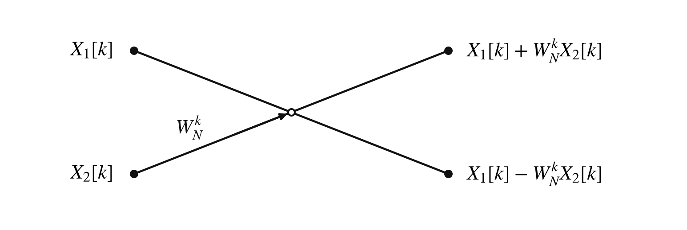
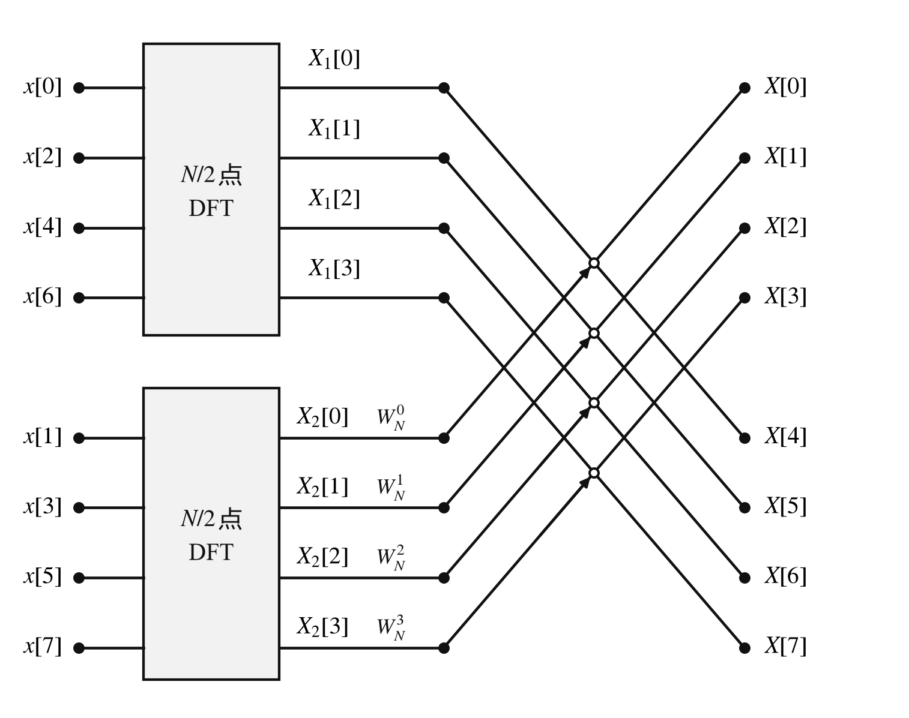
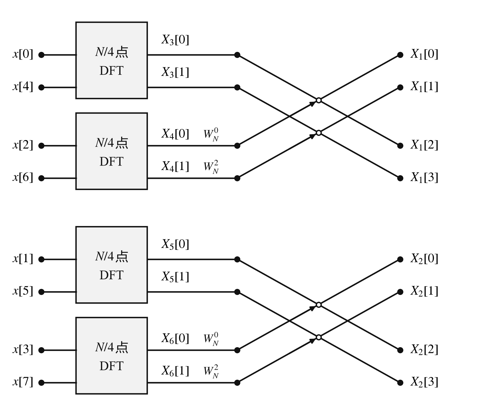
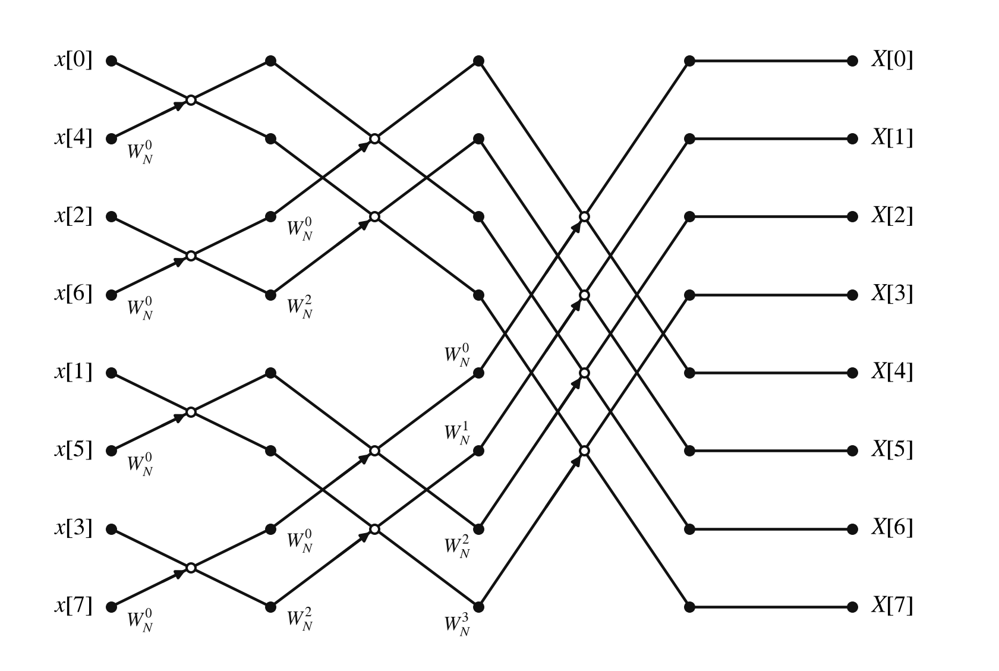

# 快速傅里叶变换（$\mathrm{FFT}$）

## $\mathrm{FFT}$ 算法的核心思想

利用复指数序列的性质将 $\mathrm{DFT}$ 定义式进行并项和化简，从而将 $N$ 点的 $\mathrm{DFT}$ 计算分解为两个 $N/2$ 点的 $\mathrm{DFT}$ 计算，并且这种分解可以一直进行下去，直至分解为 $2$ 点 $\mathrm{DFT}$。

习惯上将复指数序列用简单的符号表示，即：

$$
e^{-\mathrm{j}\frac{2\pi}{N} n k} = W_N^{n k} \quad \left( W_N = e^{-\mathrm{j}\frac{2\pi}{N}} \right)
$$

$W_N^{n k}$ 的性质：

- $W_N^{n k} = W_N^{n k + l N}$；

- $W_N^{N/2} = -1$；

- $W_N^{n k + N/2} = -W_N^{n k}$；

- $W_N^{2 n k} = W_{N/2}^{n k}$。

引入 $W_{N}^{nk}$ 后，$\mathrm{DFT}$ 定义式可以写为：

$$
X[k]=\sum_{n = 0}^{N - 1}x[n]W_{N}^{nk}
$$

## $N$ 点 $\mathrm{DFT}$ 计算分解为两个 $N/2$ 点的 $\mathrm{DFT}$ 计算

设 $N$ 为偶数，则可将 $N$ 点的 $x[n]$ 分为两组 $N/2$ 点的等长序列。所有 $n$ 为偶数的点构成一序列 $x_1[n]$，所有 $n$ 为奇数的点构成另一序列 $x_2[n]$，即：

$$
x_1[n] = x[2r], \quad x_2[n] = x[2r + 1] \quad \left( n = r = 0, 1, \dots, \frac{N}{2} - 1 \right)
$$

则：

$$
X[k] = X_1[k] + W_N^{k} X_2[k] \quad (k = 0, 1, \dots, N - 1)
$$

其中：

$$
X_1[k] = \sum_{r=0}^{\frac{N}{2}-1} x[2r] W_{N/2}^{r k} = \sum_{n=0}^{\frac{N}{2}-1} x_1[n] W_{N/2}^{n k} \quad (k = 0, 1, \dots, \frac{N}{2} - 1)
$$

$$
X_2[k] = \sum_{r=0}^{\frac{N}{2}-1} x[2r + 1] W_{N/2}^{r k} = \sum_{n=0}^{\frac{N}{2}-1} x_2[n] W_{N/2}^{n k} \quad (k = 0, 1, \dots, \frac{N}{2} - 1)
$$

由于 $X_1[k]$ 与 $X_2[k]$ 的 $k$ 值范围和 $X[k]$ 的 $k$ 值范围不同，而 $X_1[k]$ 和 $X_2[k]$ 本质上是周期为 $\dfrac{N}{2}$ 的周期序列，于是上式可改写为：

$$
X[k] = X_1[k] + W_N^{k} X_2[k], \quad \left(k = 0, 1, \dots, \frac{N}{2} - 1\right)
$$

$$
X\left[k + \frac{N}{2}\right] = X_1[k] - W_N^{k} X_2[k], \quad \left(k = 0, 1, \dots, \frac{N}{2} - 1\right)
$$

## 蝶形运算结构

时间抽取 $2^M$ 点算法流程的几个特点：

- $N = 2^M$ 点的 $\mathrm{DFT}$ 计算分解 $M$ 次后，成为 $2$ 点的 $\mathrm{DFT}$ 运算。所以流程图共有 $M$ 级蝶形运算。

- 在每一级中有 $N/2$ 个蝶形运算。

- 在时间抽取算法流程图中，输入序列的顺序符合二进制码位倒置规律。输出序列的顺序是自然顺序。

- $W_N^{n k}$ 的按级（纵向）排列规则如下表所示。

  | 蝶级 $m$ | $W_N$ 取值                                            | 重复次数 |
  | :------: | :---------------------------------------------------- | :------: |
  |   $1$    | $W_N^0$                                               |  $N/2$   |
  |   $2$    | $W_N^0,\; W_N^{N/4}$                                  |  $N/4$   |
  |   $3$    | $W_N^0,\; W_N^{N/8},\; W_N^{2N/8},\; W_N^{3N/8}$      |  $N/8$   |
  | $\vdots$ | $\vdots$                                              | $\vdots$ |
  |   $m$    | $W_N^{k \cdot 2^{M-m}}\;(k = 0, 1, \dots, 2^{m-1}-1)$ | $N/2^m$  |
  | $\vdots$ | $\vdots$                                              | $\vdots$ |
  |   $M$    | $W_N^0,\; W_N^1,\; W_N^2,\; \dots,\; W_N^{N/2-1}$     |   $1$    |
