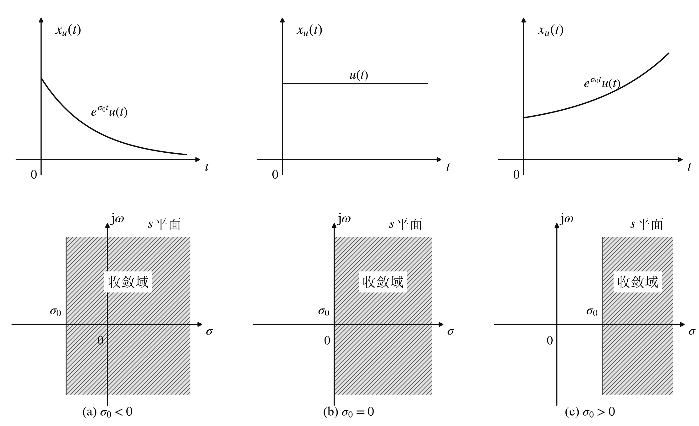
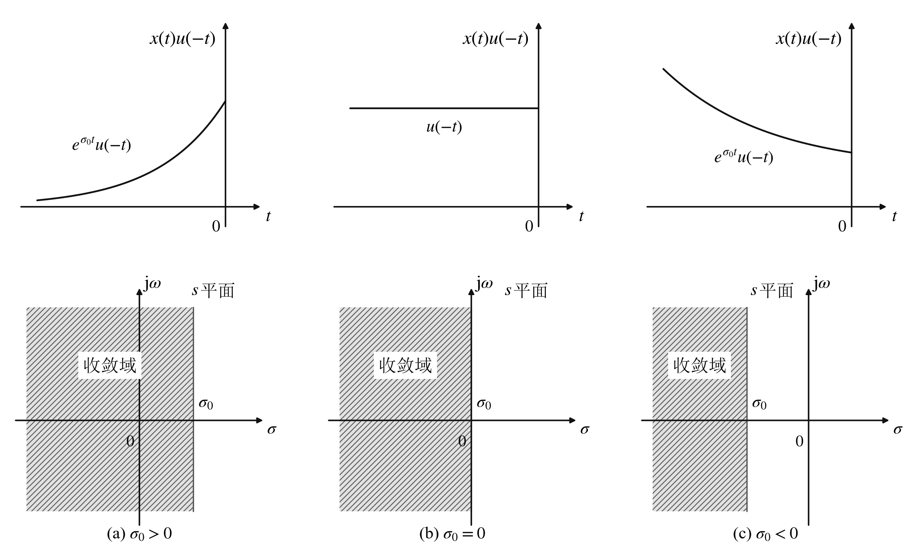
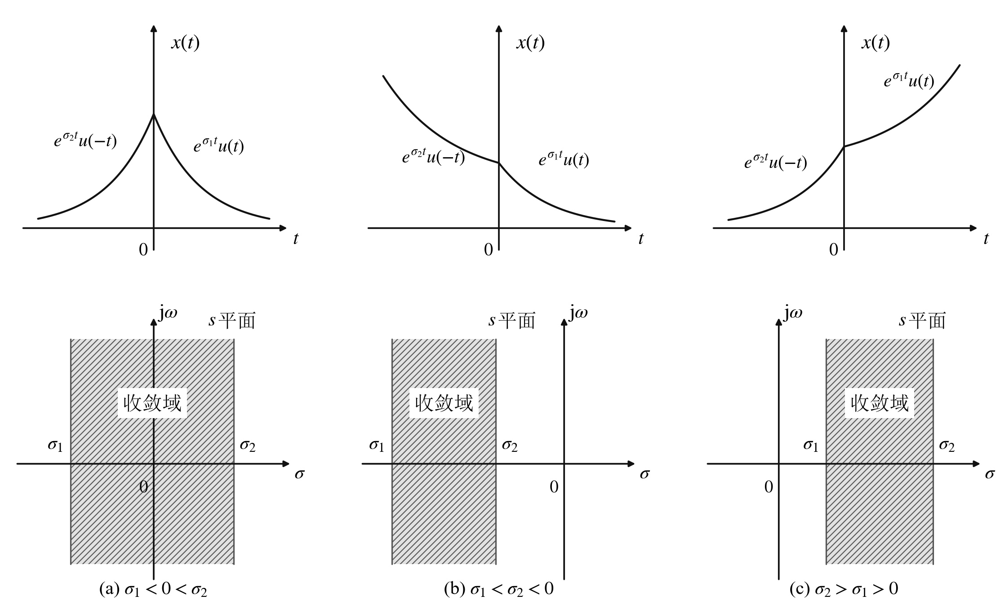

# 拉普拉斯变换

## 拉普拉斯变换的定义及收敛域

### 双边信号的拉普拉斯变换

$$
X(s) = \int_{-\infty}^{\infty} x(t) e^{-st} \, \mathrm{d}t \quad (s = \sigma + \mathrm{j}\omega)
$$

上式即为双边拉普拉斯正变换定义式。

$$
x(t) = \frac{1}{2\pi \mathrm{j}} \int_{\sigma - \mathrm{j}\infty}^{\sigma + \mathrm{j}\infty} X(s) e^{st} \, \mathrm{d}s
$$

上式即为双边拉普拉斯逆变换定义式。

可以称 $x(t)$ 为原函数，$X(s)$ 为像函数。

为表示简便，双边拉普拉斯正变换、逆变换和变换对常用下列符号表示：

$$
X(s) = \mathscr{L}\{x(t)\}; \quad x(t) = \mathscr{L}^{-1}\{X(s)\}; \quad x(t) \xleftrightarrow{\mathscr{L}} X(s)
$$

**注**：直流信号的双边信号拉普拉斯变换是不存在的（说明双边拉普拉斯变换不能用）。

### 单边信号的拉普拉斯变换

$$
X_u(s) = \int_{0^{-}}^{\infty} x(t) e^{-st} \, \mathrm{d}t
$$

上式即为单边拉普拉斯变换定义式。积分下限取 $0^{-}$ 是为了取到 $t = 0$ 时的取值。

$$
x_u(t) = x(t) u(t) = \frac{1}{2\pi \mathrm{j}} \int_{\sigma - \mathrm{j}\infty}^{\sigma + \mathrm{j}\infty} X_u(s) e^{st} \, \mathrm{d}s
$$

上式即为单边拉普拉斯逆变换定义式。

为表示简便，单边拉普拉斯正变换、逆变换和变换对常用下列符号表示：

$$
X_u(s) = \mathscr{L}\{x_u(t)\}; \quad x_u(t) = \mathscr{L}^{-1}\{X_u(s)\}; \quad x_u(t) \xleftrightarrow{\mathscr{L}} X_u(s)
$$

### 拉普拉斯变换的收敛域特征

#### 右边单边信号拉普拉斯变换 $X_u(s)$ 的收敛域特征

所谓拉普拉斯变换的收敛域是指：在 $s = \sigma + \mathrm{j}\omega$ 复平面上由 $\sigma$ 取值划分的、能够使得拉普拉斯变换积分收敛的 $s$ 平面区域。需要注意其包含的两点概念：

- 拉普拉斯变换是通过调节指数衰减函数 $e^{-\sigma t}$ 中的 $\sigma$ 值来改善积分收敛性的；
- 拉普拉斯变换需保留 $\omega$ 在 $(-\infty, +\infty)$ 范围内的每个取值。

在这两点的基础上，说明右边单边信号拉普拉斯变换 $X_u(s)$ 的收敛域具有如下主要特征：

- 对于时限单边信号，$X_u(s)$ 的收敛域为整个 $s$ 平面。这是因为 $s$ 取任何值时，积分均可收敛；

- 由于 $X_u(s)$ 积分区间为 $[0^{-}, +\infty)$，必定是 $\sigma$ 大于某个值 $\sigma_0$ 后 $e^{-\sigma t}$ 才具有足够快的衰减，使得 $e^{-\sigma t} x(t)$ 可积。因此其收敛域一定是 $s$ 平面上某个 $\sigma = \sigma_0$ 纵向直线的右半 $s$ 平面，即收敛域为 $\sigma > \sigma_0$。分界线 $\sigma = \sigma_0$ 称为收敛轴，收敛轴属于不收敛区。

- 当 $x_u(t)$ 为指数衰减信号时，收敛域包含 $\omega$ 轴 $(\sigma_0 < 0)$；
  
  当 $x_u(t)$ 为等幅信号时，收敛轴与 $\omega$ 轴重合 $(\sigma_0 = 0)$；

  当 $x_u(t)$ 为指数增长信号时，收敛域不包含 $\omega$ 轴 $(\sigma_0 > 0)$。

  比指数增长更快的 $x_u(t)$，其拉普拉斯变换不存在。

- 即使引入频域冲激函数，指数增长信号 $e^{at} u(t)$ 的傅里叶变换也是不存在的。这一概念在 $s$ 域中体现为其收敛域不包含 $\omega$ 轴。因此有意义的收敛域特征是衰减信号和等幅信号所对应的收敛域。

#### 左边单边信号拉普拉斯变换的收敛域特征

同理，有意义的收敛域特征是左边衰减信号和等幅信号所对应的收敛域。

#### 双边信号拉普拉斯变换 $X(s)$ 的收敛域特征

双边信号拉普拉斯变换 $X(s)$ 的积分必须分 $(-\infty, 0^{-}]$ 和 $[0^{-}, +\infty)$ 两段进行计算，如果能存在 $\sigma$ 使得两段积分均收敛，则收敛点 $\sigma$ 一定具有 $\sigma_2 > \sigma > \sigma_1$ 的形式，所以 $X(s)$ 收敛域的典型特征是 $s$ 平面上纵向延伸至正负无穷的带状区域。

同理，有意义的收敛域特征是双边衰减信号对应的收敛域。

**总结**：

- 有限时长信号的 $X(s)$ 和 $X_u(s)$ 收敛域均为整个 $s$ 平面；
- 无限时长右边单边信号 $x_u(t)$ 的 $X_u(s)$ 具有单收敛轴，收敛域为收敛轴的右半平面；
- 无限时长左边单边信号的 $X(s)$ 具有单收敛轴，收敛域为收敛轴的左半平面；
- 无限时长双边信号 $x(t)$ 的 $X(s)$ 具有双收敛轴，收敛域为两收敛轴之间的纵向带状区域；
- 如果要求由傅里叶变换存在，则拉普拉斯变换像函数的收敛域需要包含 $s$ 平面 $\omega$ 轴，至少收敛轴和 $\omega$ 轴重合。

### 拉普拉斯变换的唯一性

唯一性是指原函数与像函数之间具有一一对应关系。

**结论**：

- 如果已知信号为右边单边信号或左边单边信号，则时域信号和其拉普拉斯变换之间是一一对应的。

  因此在单边信号的拉普拉斯变换中讨论中通常不标注像函数的收敛域。

- 双边信号与其像函数之间的对应关系，需要结合收敛域进行判定，即

  $$
  X(s) \text{ 的函数表达式} + X(s) \text{ 的收敛域} \xleftrightarrow{\text{一一对应}} x(t)
  $$

### 拉普拉斯变换和傅里叶变换之间的关系

在拉普拉斯变换中令 $\sigma = 0$ 则得到傅里叶变换，即

$$
X(\omega) = \left. X(s) \right|_{s = \mathrm{j}\omega}
$$

$$
X_u(\omega) = \left. X_u(s) \right|_{s = \mathrm{j}\omega}
$$

**注**：

- 只有 $x(t)$ 或 $x_u(t)$ 满足绝对可积条件时，方有上述关系式成立（因为不满足绝对可积条件时，傅里叶变换会含有冲激函数，而拉普拉斯变换并未引入 $s$ 域冲激函数）。

- 只有 $X(s)$ 或 $X_u(s)$ 的收敛域包含 $s$ 平面 $\omega$ 轴时，方有上述关系成立。

## 拉普拉斯变换的性质

- **性质 1（线性）**

  $$
  a x_u(t) + b y_u(t) \xleftrightarrow{\mathscr{L}} a X_u(s) + b Y_u(s)
  $$

  $$
  a x(t) + b y(t) \xleftrightarrow{\mathscr{L}} a X(s) + b Y(s)
  $$

- **性质 2（时移特性）**

  $$
  x_u(t - t_0) \xleftrightarrow{\mathscr{L}} X_u(s) e^{-s t_0} \quad (t_0 > 0)
  $$

  $$
  x(t - t_0) \xleftrightarrow{\mathscr{L}} X(s) e^{-s t_0}
  $$

  $$
  x(t - t_0) u(t) \xleftrightarrow{\mathscr{L}} e^{-s t_0} \left[ X_u(s) + \int_{-t_0}^{0^{-}} x(\tau) e^{-s\tau} \, \mathrm{d}\tau \right] \quad (t_0 > 0)
  $$

  $$
  x(t + t_0) u(t) \xleftrightarrow{\mathscr{L}} e^{s t_0} \left[ X_u(s) - \int_{0^{-}}^{t_0} x(\tau) e^{-s\tau} \, \mathrm{d}\tau \right] \quad (t_0 > 0)
  $$

  注意区分 $x_u(t - t_0) = x(t - t_0) u(t - t_0)$ 和 $x(t - t_0) u(t)$ 的区别。

- **性质 3（尺度变换特性）**

  $$
  x_u(a t) \xleftrightarrow{\mathscr{L}} \frac{1}{a} X_u\!\left(\frac{s}{a}\right) \quad (a > 0)
  $$

  $$
  x(a t) \xleftrightarrow{\mathscr{L}} \frac{1}{|a|} X\!\left(\frac{s}{a}\right)
  $$

- **性质 4（时域微分性质）**

  $$
  \frac{\mathrm{d} x_u(t)}{\mathrm{d}t} = [x(t) u(t)]' \xleftrightarrow{\mathscr{L}} s X_u(s)
  $$

  $$
  \frac{\mathrm{d} x(t)}{\mathrm{d}t} = x'(t) \xleftrightarrow{\mathscr{L}} s X(s)
  $$

  $$
  x'(t) u(t) \xleftrightarrow{\mathscr{L}} s X_u(s) - x(0^{-})
  $$

  **推论**：

  $$
  x^{(k)}(t) u(t) = \frac{\mathrm{d}^k x(t)}{\mathrm{d}t^k} u(t) \xleftrightarrow{\mathscr{L}} s^k X_u(s) - s^{k-1} x(0^{-}) - \cdots - x^{(k-1)}(0^{-})
  $$

- **性质 5（时域积分特性）**

  $$
  \left( \int_{0^{-}}^{t} x(\tau) \, \mathrm{d}\tau \right) u(t) \xleftrightarrow{\mathscr{L}} \frac{X_u(s)}{s}
  $$

  $$
  \left( \int_{-\infty}^{t} x(\tau) \, \mathrm{d}\tau \right) u(t) \xleftrightarrow{\mathscr{L}} \frac{X_u(s)}{s} + \frac{\int_{-\infty}^{0^{-}} x(\tau) \, \mathrm{d}\tau}{s}
  $$

  $$
  \int_{-\infty}^{t} x(\tau) \, \mathrm{d}\tau \xleftrightarrow{\mathscr{L}} \frac{X(s)}{s}
  $$

- **性质 6（时域卷积性质）**

  $$
  x_u(t) * h_u(t) \xleftrightarrow{\mathscr{L}} X_u(s) H_u(s)
  $$

  $$
  x(t) * h(t) \xleftrightarrow{\mathscr{L}} X(s) H(s)
  $$

- **性质 7（$s$ 域平移性质）**

  $$
  x_u(t) e^{s_0 t} \xleftrightarrow{\mathscr{L}} X_u(s - s_0)
  $$

  $$
  x(t) e^{s_0 t} \xleftrightarrow{\mathscr{L}} X(s - s_0)
  $$

- **性质 8（$s$ 域微分性质）**

  $$
  -t x(t) u(t) \xleftrightarrow{\mathscr{L}} \frac{\mathrm{d} X_u(s)}{\mathrm{d}s} = X_u'(s)
  $$

  $$
  -t x(t) \xleftrightarrow{\mathscr{L}} \frac{\mathrm{d} X(s)}{\mathrm{d}s} = X'(s)
  $$

- **性质 9（$s$ 域积分性质）**

  $$
  \frac{x(t)}{t} \xleftrightarrow{\mathscr{L}} \int_{s}^{\infty} X(v) \, \mathrm{d}v
  $$

- **性质 10（$s$ 域卷积性质）**

  $$
  x_1(t) x_2(t) \xleftrightarrow{\mathscr{L}} \frac{1}{2\pi \mathrm{j}} \int_{\sigma - \mathrm{j}\infty}^{\sigma + \mathrm{j}\infty} X_1(\lambda) X_2(s - \lambda) \, \mathrm{d}\lambda
  $$

- **性质 11（初值定理）**

  设 $x_u(t)$ 在 $t = 0$ 时刻不含 $\delta(t)$ 或其导数，则有

  $$
  x_u(0^{+}) = x(0^{+}) = \lim_{s \to \infty} s X_u(s)
  $$

  其中 $x_u(0^{+}) = x(0^{+})$ 是因为 $x_u(0^{+}) = x(0^{+}) u(0^{+}) = x(0^{+})$。当 $x_u(t)$ 含有 $\delta(t)$ 或其导数时，$\lim\limits_{s \to \infty} s X_u(s) \to \infty$。

- **性质 12（终值定理）**

  若 $\lim\limits_{t \to \infty} x_u(t) = x_u(\infty)$ 存在，则

  $$
  x_u(\infty) = \lim_{s \to 0} s X_u(s)
  $$
