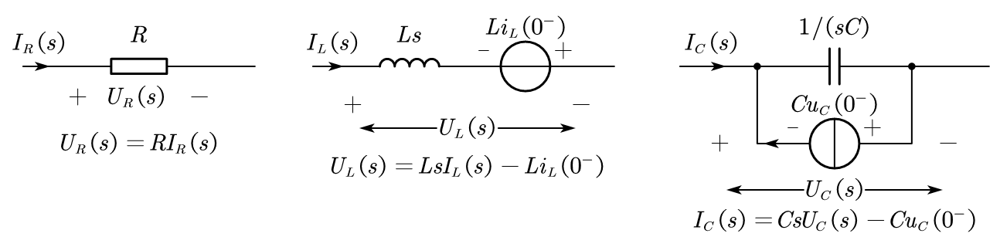
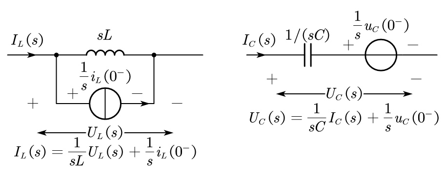
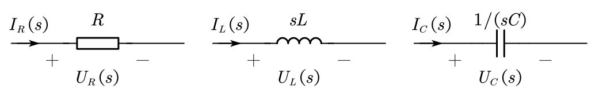

# 系统的 $s$ 域响应

**注**：系统响应求解仅需单边信号拉普拉斯变换。因此本文件中的信号均为单边信号及其 $s$ 域函数，下标 $u$ 均省略。

## 微分方程描述系统的响应求解

### 冲激响应求解

冲激响应是系统在零状态下由 $\delta(t)$ 激励系统后输出。零状态意味着：

$$
y(0^{-}) = y'(0^{-}) = \cdots = 0
$$

求解冲激响应的步骤：

1. 系统微分方程两边进行单边信号拉普拉斯变换得频域单位冲激响应；

2. 求逆变换即得到单位冲激响应。

### 零状态响应求解

零状态响应是系统在零状态情况下由 $x(t)$ 激励系统产生的输出响应。

求解方法同上。

### 零输入响应求解

零输入响应是在输入为零的情况下由系统初始储能（即非零初始状态）产生的输出响应。

求解零输入响应的步骤：

1. 将系统微分方程的右边（即输入部分）置零，变为齐次方程。

2. 两边进行单边信号拉普拉斯变换，并注意代入 $0^{-}$ 时刻初始状态值。

3. 求逆变换得零输入响应。

### 完全响应求解

系统同时在输入 $x(t)$ 和初始储能作用下产生的响应则为完全响应，即：

$$
\text{完全响应} = \text{零状态响应} + \text{零输入响应}
$$

$$
y(t) = y_{zs}(t) + y_{zi}(t)
$$

### 初始状态的跳变

外界激励在 $t = 0$ 时刻的接入可能导致系统状态在 $t = 0$ 时发生跳变，即从 $0^{-}$ 时刻状态值跳变到 $0^{+}$ 时刻状态值。

## 电路的 $s$ 域分析

### 理想 $RLC$ 元件的 $s$ 域等效模型

$RLC$ 元件的伏安特性关系为：

$$
u_R(t) = R i_R(t)
$$

$$
u_L(t) = L \frac{\mathrm{d} i_L(t)}{\mathrm{d}t}
$$

$$
i_C(t) = C \frac{\mathrm{d} u_c(t)}{\mathrm{d}t}
$$

两边取单边信号拉普拉斯变换并考虑到时域微分性质有：

$$
U_R(s) = R I_R(s)
$$

$$
U_L(s) = L s I_L(s) - L i_L(0^{-})
$$

$$
I_C(s) = C s U_C(s) - C u_C(0^{-})
$$

利用电压源和电流源的等效互换，可将上图模型转换为下图模型

当电路的初始状态为零时，只要令相应的电压源为短路、电流源为开路即可。

### 电路的 $s$ 域模型求解

将一个电路中所有的器件用 $s$ 域等效模型代替，则可得该电路的 $s$ 域模型。对此模型可以应用直流电阻电路的一套分析方法进行求解和计算，最后将求得的 $s$ 域解进行拉普拉斯逆变换即可。

## 自由响应与强迫响应、稳态响应与暂态响应

### 自由响应与强迫响应

自由响应分量和强迫响应分量的概念源于系统响应的微分方程经典解法。线性微分方程的完全解由两部分构成：齐次微分方程的通解和非齐次方程的特解。在系统响应求解中分别称为自由响应和强迫响应，即：

$$
\text{完全响应} = \text{自由响应（通解）} + \text{强迫响应（特解）}
$$

上述两个响应分量在 $s$ 域中的构成，可按 $s$ 域系统响应的部分分式定义：

$$
Y(s) = H(s) X(s) = \underbrace{\sum_i \frac{K_i^H}{s - p_i^H}}_{\text{自由响应}} + \underbrace{\sum_j \frac{K_j^X}{s - p_j^X}}_{\text{强迫响应}}
$$

其中 $p_i^H$ 是系统 $H(s)$ 的极点，$p_j^X$ 是输入 $X(s)$ 的极点。

上式表明：所有 $H(s)$ 的极点对应的响应为自由响应；所有 $X(s)$ 的极点对应的响应为强迫响应。

### 稳态响应与暂态响应

系统的完全响应也可以分解为暂态响应和稳态响应，即：

$$
\text{完全响应} = \text{稳态响应} + \text{暂态响应}
$$

随着 $t \to \infty$ 而趋于零的响应分量称为暂态响应，其余部分为稳态响应。
