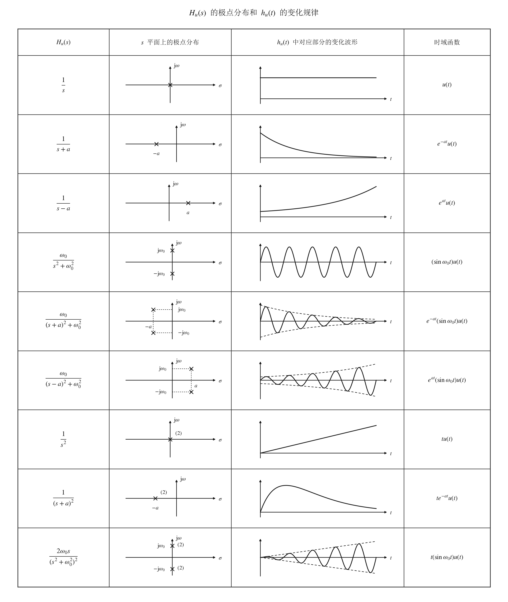

# 系统的 $s$ 域分析

## 系统函数与系统特性

### 因果系统的系统函数

可以实现的连续时间系统必须具有因果性，其冲激响应是单边信号，即：

$$
h_u(t) = h(t) u(t)
$$

两边进行拉普拉斯变换得：

$$
H_u(s) = \mathscr{L}\{h_u(t)\} = \mathscr{L}\{h(t) u(t)\}
$$

称 $H_u(s)$ 为因果系统的系统函数，一般简称系统函数。

系统函数的两个基本性质：

- 系统函数一般为有理分式，即：

  $$
  H_u(s) = \frac{B(s)}{A(s)} = \frac{b_M s^M + \dots + b_1 s + b_0}{a_N s^N + \cdots + a_1 s + a_0}
  $$

  其中分子分母多项式的系数为实数。对于微分方程描述的系统，上式分母和分子多项式的系数分别为微分方程两端的系数。

- 当 $H_u(s)$ 的收敛域包含 $\omega$ 轴时，系统频率响应函数可由 $H_u(s)$ 确定，即：

  $$
  H(\omega) = \left. H_u(s) \right|_{s = \mathrm{j}\omega}
  $$

  可实现系统的系统函数，其收敛域一定包含 $\omega$ 轴。

### $H_u(s)$ 极点位置与 $h_u(t)$ 波形之间的关系

将 $H_u(s)$ 进行部分分式展开：

$$
H_u(s) = \underbrace{\sum_i \frac{K_i}{s - p_i}}_{\text{单阶极点}} + \underbrace{\sum_j \frac{K_{j,1}s + K_{j,2}}{(s - p_j)^2}}_{\text{二阶极点}} + \underbrace{\cdots}_{\text{高阶极点}}
$$

从拉普拉斯逆变换的求解过程和典型单边信号拉普拉斯变换对可以知道：上式中极点位置和阶数的不同，所对应的时域信号将有不同的形式。

- 若极点位于左半 $s$ 平面（不包括虚轴），无论是单重极点还是多重极点，$h_u(t)$ 中与该极点对应的信号分量具有指数衰减特征；

- 若极点位于右半 $s$ 平面（不包括虚轴），无论是单重极点还是多重极点，$h_u(t)$ 中与该极点对应的信号分量具有指数增长特征；

- 若极点位于虚轴上且为单阶极点，$h_u(t)$ 中与该极点对应的信号分量具有恒幅特征；
  
  若极点位于虚轴上但为多重极点，$h_u(t)$ 中与该极点对应的信号分量具有幂函数增幅特征；

- 实数极点不产生振荡；共轭复数极点产生振荡。

零点的不同位置对冲激响应的变化规律不产生实质性影响。

### 因果稳定系统的极点分布

因果系统未必是稳定系统，稳定系统也未必是因果系统，只有因果稳定系统才能实际使用。

- **因果稳定系统**：$H_u(s)$ 的所有极点位于 $s$ 左半平面。

- **因果不稳定系统**：$H_u(s)$ 含有 $s$ 右半平面极点或虚轴上的高阶极点。

- **临界稳定系统**：$H_u(s)$ 在虚轴上有一阶极点但无高阶极点，无右半 $s$ 平面极点。

  **注**：从 BIBO 稳定性定义判定，临界稳定系统属于不稳定系统，因为只要存在某个有界输入使得输出无界，则系统被视为不稳定系统。

## 系统函数与系统频率响应特性

### $H(s)/H_u(s)$ 和 $H(\omega)$ 的关系

当系统函数的收敛域包含虚轴时有：

$$
H(\omega) = \left. H(s) \right|_{s = \mathrm{j}\omega}; \quad H_u(\omega) = \left. H_u(s) \right|_{s = \mathrm{j}\omega}
$$

因果稳定系统的系统函数，其收敛域包含虚轴。

### 频率响应函数的 $s$ 平面矢量计算

$H_u(\omega)$ 可用零极点表示为：

$$
H_u(\omega) = \left. H_u(s) \right|_{s = \mathrm{j}\omega} = \left. K \frac{\prod\limits_{k=1}^{M}(s - z_k)}{\prod\limits_{i=1}^{N}(s - p_i)} \right|_{s = \mathrm{j}\omega} = K \frac{\prod\limits_{k=1}^{M}(\mathrm{j}\omega - z_k)}{\prod\limits_{i=1}^{N}(\mathrm{j}\omega - p_i)}
$$

上式中零点 $z_k$ 和极点 $p_i$ 是 $s$ 平面上的定点，$\mathrm{j}\omega$ 是虚轴上随 $\omega$ 变化的动点。

将复平面上的点和始于坐标系原点的矢量一一对应后，由矢量加减运算的几何意义可知：零点因子 $(\mathrm{j}\omega - z_k) = B_k e^{\psi_k}$ 和极点因子 $(\mathrm{j}\omega - p_i) = A_i e^{\theta_i}$ 分别是从零点和极点指向 $\mathrm{j}\omega$ 点的矢量。考虑所有的零极点后，频率响应函数的模 $|H_u(\omega)|$ 和幅角 $\varphi(\omega)$ 可由每个矢量的模和幅角确定，即：

$$
|H_u(\omega)| = K \frac{B_1 B_2 \cdots B_M}{A_1 A_2 \cdots A_N}
$$

$$
\varphi(\omega) = \psi_1 + \psi_2 + \cdots + \psi_M - (\theta_1 + \theta_2 + \cdots + \theta_N)
$$

原理上讲，在 $\omega$ 沿着虚轴从 $0$ 移向 $+\infty$ 的过程中，逐点计算模与幅角的值，则可分别绘制出幅频特性曲线和相频特性曲线。

## 全通系统

### 全通系统的定义及其零极点分布特征

如果一个系统的频率响应在整个频率范围内有 $|H(\omega)| = K$（$K$ 为常量），则该系统称为全通系统。可用 $H_{ap}(s)$ 表示。

零极点分布特征：

- 系统函数的所有零点均位于右半 $s$ 平面，所有极点均位于左半 $s$ 平面，从而保证系统稳定性；

- 零极点的分布关于虚轴对称。

- 复数零点和极点均共轭成对出现。

### 最简全通系统

如果零极点是位于实轴上的单阶节点，则构成了一个最简全通系统，即：

$$
H(s) = \frac{s - a}{s + a}, \quad H(\omega) = \frac{\mathrm{j}\omega - a}{\mathrm{j}\omega + a}, \quad |H(\omega)| = \frac{\sqrt{\omega^2 + a^2}}{\sqrt{\omega^2 + a^2}} = 1 \quad (a > 0)
$$

实现 $|H(\omega)| = 1$ 全通的根本原因是极点矢量模和零点矢量模始终相等。

$|H(\omega)| = K$ 只意味着系统对输入系统的所有频率分量都具有相同的增益，但这并不意味着不产生信号的波形失真，无失真传输需要系统具有线性相位特性。

对于有 $N$ 对零极点的 $N$ 阶全通系统，当 $\omega$ 从 $0$ 变化至 $\infty$ 时，相位变化量将为 $N\pi$。与非全通系统相比，全通系统的相位变化量是最大的。

## 最小相位系统

如果系统函数 $H(s)$ 的全部极点均位于左半 $s$ 平面上，全部零点位于左半 $s$ 平面上或虚轴上，则称该系统为最小相位系统。可用 $H_{mp}(s)$ 表示。

**注**：最小相位系统并未要求零点数和极点数相同。

## 非最小相位系统的表示

当 $H(s)$ 含有一个或多个右半 $s$ 平面零点时，则为非最小相位系统。

一个非最小相位系统函数 $H(s)$ 可表示成一个全通系统函数 $H_{ap}(s)$ 和一个最小相位系统函数 $H_{mp}(s)$ 的乘积，即：

$$
H(s) = H_{ap}(s) \cdot H_{mp}(s)
$$

$$
|H(\omega)| = |H_{mp}(\omega)| \cdot |H_{ap}(\omega)| = K|H_{mp}(\omega)|
$$

$$
\varphi(\omega) = \varphi_{mp}(\omega) + \varphi_{ap}(\omega)
$$

因此，最小相位系统 "最小" 二字更为准确的含义：在所有幅频特性等于 $|H(\omega)|$ 的系统中，$H_{mp}(s)$ 具有最小相位。

由于最小相位系统 $H_{mp}(s)$ 的所有零极点都位于左半 $s$ 平面，其逆系统 $1/H_{mp}(s)$ 的所有零极点也位于左半 $s$ 平面（只是零点变为极点，极点变为零点），即逆系统也是稳定的，且也是最小相位系统。
