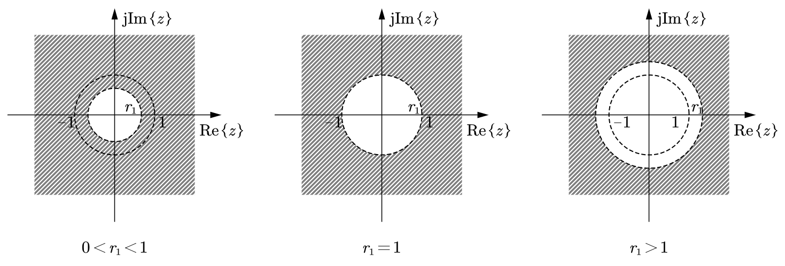
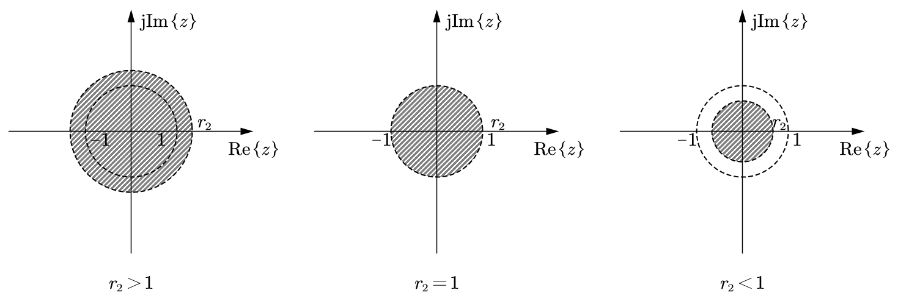
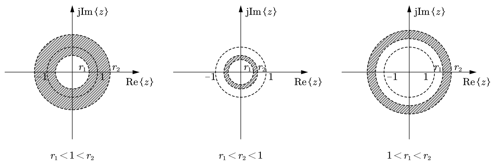

# $z$ 变换

## $z$ 变换的定义及收敛域

### 双边序列的 $z$ 变换

$$
X(z) = \sum_{n=-\infty}^{\infty} x[n] z^{-n} \quad (z = re^{\mathrm{j}\Omega})
$$

上式即为双边正 $z$ 变换定义式。

$$
x[n] = \frac{1}{2\pi \mathrm{j}} \oint_c X(z) z^{n-1} \, \mathrm{d}z
$$

上式即为双边逆 $z$ 变换定义式。

为表示简便，正逆 $z$ 变换和变换对常用下列符号表示：

$$
X(z) = \mathscr{Z}\{x[n]\}; \quad x[n] = \mathscr{Z}^{-1}\{X(z)\}; \quad x[n] \xleftrightarrow{\mathscr{Z}} X(z)
$$

**注**：直流信号的双边序列 $z$ 变换是不存在的。

### 单边序列的 $z$ 变换

$$
X_u(z) = \sum_{n=0}^{\infty} x[n] z^{-n}
$$

上式即为单边 $z$ 变换定义式。

单边逆 $z$ 变换定义式与双边逆 $z$ 变换定义式相同：

$$
x[n] = \frac{1}{2\pi \mathrm{j}} \oint_c X(z) z^{n-1} \, \mathrm{d}z
$$

### $z$ 变换的收敛域特征

#### 右边单边序列 $z$ 变换的收敛域特征

由于 $X_u(z)$ 的求和区间为 $[0,\infty)$，$X_u(z)$ 的收敛域具有如下主要特征：

- 有限长单边序列 $x_u[n]$ 的 $X_u(z)$ 收敛域为除 $z=0$ 外的整个 $z$ 平面。

- 无限长单边序列 $x_u[n]$ 的 $X_u(z)$ 收敛域为 $z$ 平面上某个圆外，即收敛域为 $|z| > r_1$ 的形式。
  
  这是因为 $X_u(z)$ 的求和项 $x[n] z^{-n} = x[n] (r e^{\mathrm{j}\Omega})^{-n} = (x[n] / r^n) e^{-\mathrm{j}\Omega n}$ 只有在 $r$ 足够大时才是衰减的。

  称 $|z| = r_1$ 为收敛圆。
  
  **注**：收敛圆本身不在收敛域范围。

- 当 $x_u[n]$ 为单边指数衰减序列时，$X_u(z)$ 的收敛域包含 $z$ 平面单位圆；
  
  当 $x_u[n]$ 为单边等幅序列时，$X_u(z)$ 的收敛圆与单位圆重合；

  当 $x_u[n]$ 为单边指数增长序列时，$X_u(z)$ 的收敛圆位于单位圆外，即收敛域不包括单位圆。

#### 左边单边序列 $z$ 变换的收敛域特征

为了避免 $n=0$ 时序列重叠，一般将在 $(-\infty,-1]$ 区间内有非零值的序列称为左边单边序列。

左边单边无限长序列的收敛域具有如下特征：

- 收敛域为 $z$ 平面某个圆内，即收敛域为 $|z| < r_2$ 的形式。

- 左边指数衰减序列（即 $n \to -\infty$ 时 $x[n] \to 0$）的收敛域将包含单位圆；

  左边等幅序列的收敛圆与单位圆重叠；

  左边指数增长序列的收敛域不包含单位圆。

#### 双边无限长序列 $z$ 变换的收敛域特征

求解双边无限长序列 $x[n]$ 的 $z$ 变换式时，需将 $x[n]$ 分为左边无限长序列和右边无限长序列进行求和，它们的收敛域分别为某个圆外和圆内，当存在公共收敛域时，则 $x[n]$ 的 $z$ 变换存在，且收敛域必为 $r_1 < |z| < r_2$ 圆环。反之，如果没有公共收敛域存在，则 $x[n]$ 的 $z$ 变换不存在。

### $z$ 变换的唯一性

- 如果已知一个序列为右边单边序列或左边单边序列，则时域序列与其 $z$ 变换函数表达式之间是一一对应的。

- 双边序列与其 $z$ 变换之间的对应关系，需要结合收敛域进行判定：

  $$
  X(z) \text{ 的函数表达式} + X(z) \text{ 的收敛域} \xleftrightarrow{\text{一一对应}} x[n]
  $$

### $z$ 变换和 $\mathrm{DTFT}$ 之间的关系

在 $z$ 变换中令 $r=1$，则得到序列 $x[n]$ 的 $\mathrm{DTFT}$，即有下列关系式成立：

$$
X(e^{\mathrm{j}\Omega}) = \mathrm{DTFT}\{x[n]\} = \left. X(z) \right|_{z = e^{\mathrm{j}\Omega}}
$$

$$
X_u(e^{\mathrm{j}\Omega}) = \mathrm{DTFT}\{x_u[n]\} = \left. X_u(z) \right|_{z = e^{\mathrm{j}\Omega}}
$$

即单位圆上的 $z$ 变换就是离散时间傅里叶变换（$\mathrm{DTFT}$）。

如果要求有上两式成立，时域中 $x[n]$ 或 $x_u[n]$ 的 $\mathrm{DTFT}$ 必须存在（满足绝对可和条件），即频域中 $X(z)$ 或 $X_u(z)$ 的收敛域必须包含单位圆。

### 双边序列 $z$ 变换与单边序列 $z$ 变换

- 离散时间的双边序列 $z$ 变换比连续时间的双边信号拉普拉斯变换重要，因为离散时间系统在处理信号时可以是非实时的，并且信号值是可以存储的，双边 $z$ 变换有应用需求。

- 对离散时间系统的因果可实现性需要有更全面的理解。由于离散时间系统的历史数据是可以存储的，因此离散时间非因果系统是 "可实现" 的。非因果系统的分析只能采用双边序列 $z$ 变换。

## $z$ 变换的性质

- **性质 1（线性）**

  $$
  a x_u[n] + b y_u[n] \xleftrightarrow{\mathscr{Z}} a X_u(z) + b Y_u(z)
  $$

  $$
  a x[n] + b y[n] \xleftrightarrow{\mathscr{Z}} a X(z) + b Y(z)
  $$

- **性质 2（位移性质）**

  $$
  x_u[n - m] \xleftrightarrow{\mathscr{Z}} X_u(z) z^{-m} \quad (m > 0)
  $$

  $$
  x[n - m] \xleftrightarrow{\mathscr{Z}} X(z) z^{-m} \quad (m > 0 \text{ 或 } m < 0)
  $$

  $$
  x[n - m] u[n] \xleftrightarrow{\mathscr{Z}} z^{-m} \left[ X_u(z) + \sum_{n=-m}^{-1} x[n] z^{-n} \right] \quad (m > 0)
  $$

  $$
  x[n + m] u[n] \xleftrightarrow{\mathscr{Z}} z^{m} \left[ X_u(z) - \sum_{n=0}^{m-1} x[n] z^{-n} \right] \quad (m > 0)
  $$

- **性质 3（指数加权性质）**

  $$
  a^n x_u[n] \xleftrightarrow{\mathscr{Z}} X_u\!\left(\frac{z}{a}\right)
  $$

  $$
  a^n x[n] \xleftrightarrow{\mathscr{Z}} X\!\left(\frac{z}{a}\right)
  $$

- **性质 4（$z$ 域微分性质）**

  $$
  n x_u[n] \xleftrightarrow{\mathscr{Z}} -z \frac{\mathrm{d} X_u(z)}{\mathrm{d}z}
  $$

  $$
  n x[n] \xleftrightarrow{\mathscr{Z}} -z \frac{\mathrm{d} X(z)}{\mathrm{d}z}
  $$

- **性质 5（时域卷积性质）**

  $$
  x_u[n] * h_u[n] \xleftrightarrow{\mathscr{Z}} X_u(z) H_u(z)
  $$

  $$
  x[n] * h[n] \xleftrightarrow{\mathscr{Z}} X(z) H(z)
  $$

- **性质 6（$z$ 域卷积性质）**

  $$
  x_u[n] h_u[n] \xleftrightarrow{\mathscr{Z}} \frac{1}{2\pi \mathrm{j}} \oint_{c_1} X_u(\lambda) H_u\!\left(\frac{z}{\lambda}\right) \lambda^{-1} \, \mathrm{d}\lambda \quad \text{或} \quad \frac{1}{2\pi \mathrm{j}} \oint_{c_2} H_u(\lambda) X_u\!\left(\frac{z}{\lambda}\right) \lambda^{-1} \, \mathrm{d}\lambda
  $$

  $$
  x[n] h[n] \xleftrightarrow{\mathscr{Z}} \frac{1}{2\pi \mathrm{j}} \oint_{c_3} X(\lambda) H\!\left(\frac{z}{\lambda}\right) \lambda^{-1} \, \mathrm{d}\lambda \quad \text{或} \quad \frac{1}{2\pi \mathrm{j}} \oint_{c_4} H(\lambda) X\!\left(\frac{z}{\lambda}\right) \lambda^{-1} \, \mathrm{d}\lambda
  $$

- **性质 7（时域差分性质）**

  $$
  x_u[n] - x_u[n-1] \xleftrightarrow{\mathscr{Z}} (1 - z^{-1}) X_u(z)
  $$

  $$
  x[n] - x[n-1] \xleftrightarrow{\mathscr{Z}} (1 - z^{-1}) X(z)
  $$

- **性质 8（时域求和性质）**

  $$
  \sum_{m=0}^{n} x_u[m] \xleftrightarrow{\mathscr{Z}} \frac{X_u(z)}{1 - z^{-1}}
  $$

  $$
  \sum_{m=-\infty}^{n} x[m] \xleftrightarrow{\mathscr{Z}} \frac{X(z)}{1 - z^{-1}}
  $$

- **性质 9（时域反转性质）**

  $$
  x_u[-n] \xleftrightarrow{\mathscr{Z}} X_u(z^{-1})
  $$

  $$
  x[-n] \xleftrightarrow{\mathscr{Z}} X(z^{-1})
  $$

- **性质 10（序列内插零）**

  $$
  x_{i,u}[n] = \begin{cases}
    x_u[n/M], & n \text{ 为 } M \text{ 的整数倍} \\
    0, & n \text{ 不为 } M \text{ 的整数倍}
  \end{cases} \xleftrightarrow{\mathscr{Z}} X_u(z^M)
  $$

  $$
  x_{i}[n] = \begin{cases}
    x[n/M], & n \text{ 为 } M \text{ 的整数倍} \\
    0, & n \text{ 不为 } M \text{ 的整数倍}
  \end{cases} \xleftrightarrow{\mathscr{Z}} X(z^M)
  $$

- **性质 11（序列抽取性质）**

  $$
  x_{d,u}[n] = x_u[Mn] \xleftrightarrow{\mathscr{Z}} \frac{1}{M} \sum_{k=0}^{M-1} X_u\!\left(z^{\frac{1}{M}} e^{-\mathrm{j} \frac{2k\pi}{M}}\right)
  $$

  $$
  x_{d}[n] = x[Mn] \xleftrightarrow{\mathscr{Z}} \frac{1}{M} \sum_{k=0}^{M-1} X\!\left(z^{\frac{1}{M}} e^{-\mathrm{j} \frac{2k\pi}{M}}\right)
  $$

- **性质 12（初值定理）**

  $$
  x_u[0] = \lim_{z \to \infty} X_u(z)
  $$

- **性质 13（终值定理）**

  $$
  x_u[\infty] = \lim_{z \to 1} [(z-1) X_u(z)]
  $$
