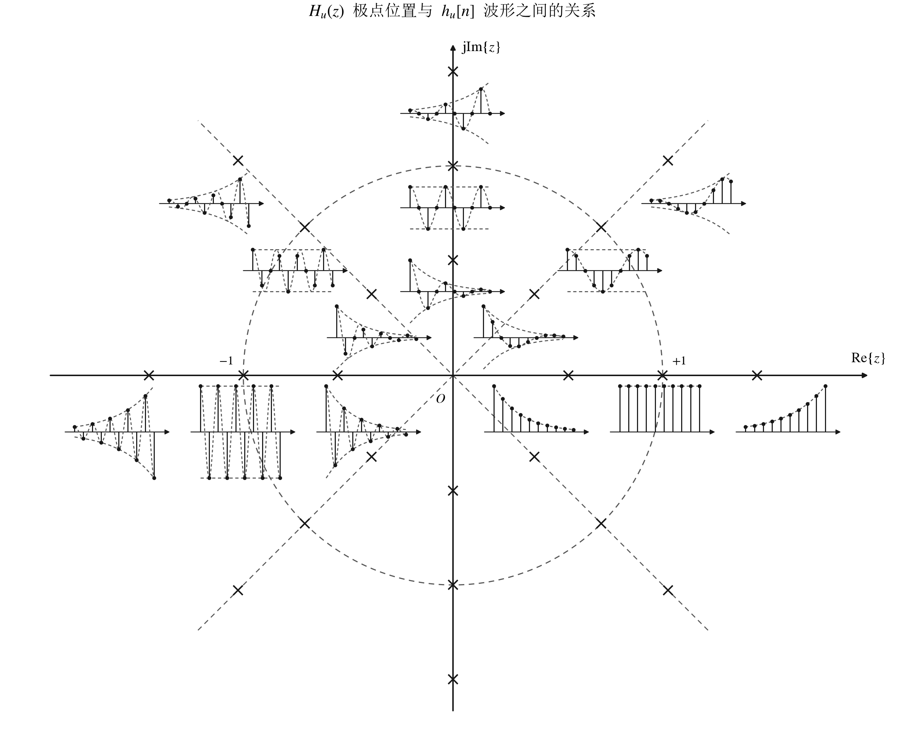

# 系统的 $z$ 域分析

## 系统函数与系统特性

### 因果系统的系统函数

因果系统的冲激响应必须是单边序列，即对于任意 $n$ 值有下式成立：

$$
h_u[n] = h[n] u[n]
$$

两边进行 $z$ 变换得：

$$
H_u(z) = \mathscr{Z}\{h_u[n]\} = \mathscr{Z}\{h[n] u[n]\}
$$

称 $H_u(z)$ 为因果系统的系统函数，一般简称系统函数。

系统函数的两个基本性质：

- 系统函数一般为有理分式，即：

  $$
  H_u(z) = \frac{B(z)}{A(z)} = \frac{b_0 + b_1 z^{-1} + \cdots + b_M z^{-M}}{a_0 + a_1 z^{-1} + \cdots + a_N z^{-N}}
  $$

  其中分子分母多项式的系数为实数。对于差分方程描述的系统，上式分母和分子多项式的系数分别为差分方程两端的系数。因果系统 $H(z)$ 分子多项式的幂次一定不高于分母多项式的幂次。

- 当 $H_u(z)$ 的收敛域包含 $z$ 平面单位圆时，系统频率响应函数可由 $H_u(z)$ 确定，即：

  $$
  H_u(e^{\mathrm{j}\Omega}) = \left. H_u(z) \right|_{z = e^{\mathrm{j}\Omega}}
  $$

### 非因果系统的系统函数

非因果系统的冲激响应 $h[n]$ 为双边序列，其双边序列 $z$ 变换定义为系统函数：

$$
H(z) = \mathscr{Z}\{h[n]\}
$$

对于非因果系统，上述两个性质仍然成立。

### $H_u(z)$ 极点位置与 $h_u[n]$ 波形之间的关系

将 $H_u(z)$ 进行部分分式展开：

$$
H_u(z) = \underbrace{\sum_i \frac{K_i}{1 - p_i z^{-1}}}_{\text{单阶极点}} + \underbrace{\sum_j \frac{K_{j}}{(1 - p_j z^{-1})^2}}_{\text{二阶极点}} + \underbrace{\cdots}_{\text{高阶极点}}
$$

从逆 $z$ 变换的求解过程和典型右边单边序列的 $z$ 变换对可以知道：上式中极点位置和阶数的不同，所对应的时域序列将有不同的形式。

- 若极点位于 $z$ 平面单位圆内（不包括单位圆），无论是单重极点还是多重极点，$h_u[n]$ 中与该极点对应的子序列具有指数衰减特征；

- 若极点位于 $z$ 平面单位圆外（不包括单位圆），无论是单重极点还是多重极点，$h_u[n]$ 中与该极点对应的子序列具有指数增长特征；

- 若极点位于 $z$ 平面单位圆上且为单阶极点，$h_u[n]$ 中与该极点对应的子序列具有恒幅特征；
  
  若极点位于 $z$ 平面单位圆上但为多重极点，$h_u[n]$ 中与该极点对应的子序列具有增幅特征；

- 正实轴上的极点不产生振荡或交替变化，负实轴上的极点产生正负交替变化，共轭复数极点产生正弦振荡。

零点的不同位置对冲激响应的变化规律不产生实质性影响。

### 因果稳定系统的极点分布

因果系统未必是稳定系统，稳定系统也未必是因果系统，只有因果稳定系统才能实际使用。

- **因果稳定系统**：$H_u(z)$ 的所有极点位于 $z$ 平面单位圆内。

- **因果不稳定系统**：$H_u(z)$ 含有 $z$ 平面单位圆外的极点或单位圆上的高阶极点。

- **临界稳定系统**：$H_u(z)$ 在单位圆上有一阶极点但无高阶极点，无单位圆外极点。

  **注**：从 BIBO 稳定性定义判定，临界稳定系统属于不稳定系统，因为只要存在某个有界输入使得输出无界，则系统被视为不稳定系统。

## 系统函数与系统频率响应特性

### $H(z)/H_u(z)$ 和 $H(e^{\mathrm{j}\Omega})$ 的关系

当系统函数的收敛域包含 $z$ 平面单位圆时有：

$$
H(e^{\mathrm{j}\Omega}) = \left. H(z) \right|_{z = e^{\mathrm{j}\Omega}}; \quad H_u(e^{\mathrm{j}\Omega}) = \left. H_u(z) \right|_{z = e^{\mathrm{j}\Omega}}
$$

因果稳定系统的系统函数，其收敛域一定包含单位圆。

### 频率响应函数的 $z$ 平面矢量计算

假定 $N \geqslant M$，将 $z^{-1}$ 多项式变换为 $z$ 多项式后分子的阶次记为 $M'$，则 $H(e^{\mathrm{j}\Omega})$ 可用零极点表示为：

$$
H(e^{\mathrm{j}\Omega}) = \left. H(z) \right|_{z = e^{\mathrm{j}\Omega}} = \left. K \frac{\prod\limits_{k=1}^{M'} (z - z_k)}{\prod\limits_{i=1}^{N} (z - p_i)} \right|_{z = e^{\mathrm{j}\Omega}} = K \frac{\prod\limits_{k=1}^{M'} (e^{\mathrm{j}\Omega} - z_k)}{\prod\limits_{i=1}^{N} (e^{\mathrm{j}\Omega} - p_i)}
$$

上式中零点 $z_k$ 和极点 $p_i$ 是 $z$ 平面上的定点，$e^{\mathrm{j}\Omega}$ 是单位圆上随 $\Omega$ 变化的动点。

将复平面上的点和始于坐标系原点的矢量一一对应后，由矢量加减运算的几何意义可知：零点因子 $(e^{\mathrm{j}\Omega} - z_k) = B_k e^{\psi_k}$ 和极点因子 $(e^{\mathrm{j}\Omega} - p_i) = A_i e^{\theta_i}$ 分别是从零点和极点指向 $e^{\mathrm{j}\Omega}$ 点的矢量。考虑所有的零极点后，频率响应函数的模 $|H(e^{\mathrm{j}\Omega})|$ 和幅角 $\varphi(\Omega)$ 可由每个矢量的模和幅角确定，即：

$$
|H(e^{\mathrm{j}\Omega})| = K \frac{B_1 B_2 \cdots B_{M'}}{A_1 A_2 \cdots A_N}
$$

$$
\varphi(\Omega) = \psi_1 + \psi_2 + \cdots + \psi_{M'} - (\theta_1 + \theta_2 + \cdots + \theta_N)
$$

$H(e^{\mathrm{j}\Omega})$ 为 $\Omega$ 的周期函数且周期为 $2\pi$。但最高数字角频率为 $\pi$，因此从 $\Omega = 0$ 开始逐渐变化到 $\Omega = \pi$，逐点计算模与幅角的值，则可分别绘制出幅频特性曲线和相频特性曲线。

## 全通系统和最小相位系统

### 全通系统

如果一个系统的频率响应在整个频率范围内有 $|H(e^{\mathrm{j}\Omega})| = K$（$K$ 为常量），则该系统称为全通系统。

零极点分布特征：

- 系统函数的所有零点均位于单位圆外，所有极点均位于单位圆内，从而保证系统稳定性；

- 对每个单位圆内极点 $p_i$，存在一个单位圆外零点 $z_i$ 使得 $|z_i| \cdot |p_i| = 1$；

- 复数零点和极点均共轭成对出现。

## 最小相位系统

如果系统函数 $H(z)$ 的全部极点均位于单位圆内，全部零点位于单位圆内或圆上，则称该系统为最小相位系统。可用 $H_{mp}(z)$ 表示。

**注**：最小相位系统并未要求零点数和极点数相同。

## 非最小相位系统的表示

当 $H(z)$ 含有一个或多个单位圆外零点时，则为非最小相位系统。

一个非最小相位系统函数 $H(z)$ 可表示成一个全通系统函数 $H_{ap}(z)$ 和一个最小相位系统函数 $H_{mp}(z)$ 的乘积，即：

$$
H(z) = H_{ap}(z) \cdot H_{mp}(z)
$$

$$
|H(e^{\mathrm{j}\Omega})| = |H_{mp}(e^{\mathrm{j}\Omega})| \cdot |H_{ap}(e^{\mathrm{j}\Omega})| = K|H_{mp}(e^{\mathrm{j}\Omega})|
$$

$$
\varphi(\Omega) = \varphi_{mp}(\Omega) + \varphi_{ap}(\Omega)
$$

因此，最小相位系统 "最小" 二字更为准确的含义：在所有幅频特性等于 $|H(e^{\mathrm{j}\Omega})|$ 的系统中，$H_{mp}(z)$ 具有最小相位。

由于最小相位系统 $H_{mp}(z)$ 的所有零极点都位于单位圆内，其逆系统 $1/H_{mp}(z)$ 的所有零极点也位于单位圆内（只是零点变为极点，极点变为零点），即逆系统也是稳定的，且也是最小相位系统。
